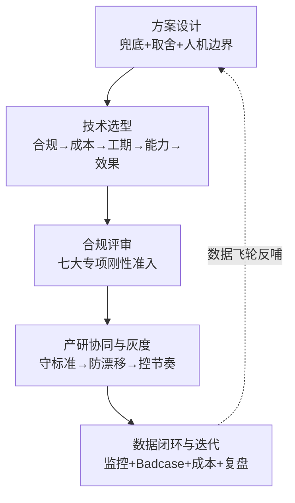

# AI 产品经理核心工作流程系列总结（深入展开版）

> 用途：把公众号「巧啊巧在努力」《AI 产品经理核心工作流程》系列 8 篇文章的核心方法论，沉淀为一份可复用的 AI PM 全生命周期知识库。面试被问「AI 产品的完整流程」「方案怎么设计」「技术怎么选型」「上线怎么保障质量/成本/合规」时，可直接引用本文框架与话术。
> 覆盖环节：方案设计 → 技术选型（×2）→ 合规评审 → 产研协同与灰度发布（×3）→ 数据闭环与持续迭代。
> 配合文档：`项目面试问答知识库.md`（面试怎么答）｜`AI产品设计.md`（Luna 落地实例）｜`AI评测集.md`｜`AI成本估算.md`｜`竞品分析.md`。
> 说明：文中"上篇/下篇"指系列内部文章互链；所有阈值为文章示例值，落地时需结合业务调整。

---

## 〇、系列总览：贯穿全文的核心思想

**一句话**：AI 产品不是"功能怎么实现"，而是"**AI 一定会出错，出错后怎么办**"。

- 传统软件方案设计基于**确定性**技术（需求合理 + 选型正确 → 功能必实现）；
- AI 产品方案设计必须假设系统**非确定**：相同输入可能不同输出、模型会幻觉、API 会超时、云端模型会静默升级、质量反馈有延迟。
- 因此整个系列的 3 个底层命题：
  1. **兜底系统设计**——出错后怎么办（降级 / 拒答 / 转人工 / 熔断 / 回滚）；
  2. **资源约束下的取舍**——预算、工期、人力有限时怎么砍（最小可行范围 / 克制迭代）；
  3. **人机协作边界**——什么交给 AI、什么交给规则、什么必须人确认（Human-in-the-loop）。

**贯穿全部环节的方法论主线**：



**PM 责任边界总原则**（反复出现）：
- 产品经理**不拍板**模型/框架的技术参数（这是研发的事）；
- 但要做：提供业务约束、要求 2-3 个候选方案 + POC 数据、在"效果验收标准"上做决策、守标准不被妥协、控制放量节奏、管控合规与成本。

---

## 第一篇：方案设计

> 原文：《AI产品经理核心工作流程---方案设计》（2026-05-14）
> 核心观点：方案设计的核心不是"功能怎么实现"，而是**把 AI 能力翻译成用户实际可操作的产品功能**，并为"AI 一定会出错"设计兜底系统。

### 1.1 业务流程梳理

**核心动作**：画出引入 AI 后的完整系统流，区分人机协作模式。每个节点必须明确 4 件事：**触发条件、执行主体（人/AI/系统）、产出物、异常出口**。

以"运营策略生成"为例（模板可直接套用）：

| 节点 | 触发条件 | 执行主体 | 产出物 | 异常出口 |
|---|---|---|---|---|
| 需求填写 | 运营手动发起 | 人工 | 结构化需求表单 | 字段不完整时阻断提交 |
| AI 生成初稿 | 表单提交成功 | AI 模型 | 策略草稿（含置信度标注） | 超时/报错 → 降级模板 |
| 人工审核 | 初稿生成完成 | 人工 | 审核通过/拒绝/修改意见 | 超时未审核 → 触发提醒/自动关闭 |
| 任务下发 | 审核通过 | 系统自动 | 营销任务工单 | 下发失败 → 重试机制 |
| 数据回流 | 任务执行完毕 | 系统自动 | 效果数据 | 数据缺失 → 标记待补全 |

**3 个特别说明**：
1. 明确每个步骤的**超时时间限制**；
2. 明确步骤间**状态流转通知**（谁在哪个节点收到什么通知）；
3. 明确 AI 处理是**异步还是同步**：生成超 5 秒是让用户等待还是后台通知？等待时的界面如何呈现？

**两类流程区分（AI 辅助决策 vs AI 自动执行）**：

| 类型 | 定义 | 适用 | 设计要求 |
|---|---|---|---|
| 辅助决策型 | AI 生成建议/内容，人确认后才执行 | 高风险或低频操作（推送策略、风控规则调整、备案整改建议） | 必须设计人工确认节点 |
| 自动执行型 | AI 直接完成，人工定期抽检 | 低风险、高频率操作（内容初筛、标签提取） | 明确抽检比例（建议 5%~10%）+ 异常升级触发条件 |

> 关键判断：**不是越智能越好，要与业务风险等级强绑定**。

**什么时候可以简化流程图**（详细程度与业务影响成正比）：

| 场景 | 简化方式 | 原因 |
|---|---|---|
| 内部效率工具 | 文字描述 + 简单状态机 | 风险可控、出错可重试 |
| MVP 验证阶段 | 只画核心路径，异常路径用 TODO 标注 | 资源有限、需快速验证 |
| 低频场景（月活<1000） | 异常路径默认转人工，不做自动化降级 | 投入产出比不划算 |

> C 端用户触达的链路必须完整；内部工具可简化。

### 1.2 Demo 验证（防"AI 能力盲区"）

**致命陷阱**：你以为 AI 能做到，其实 AI 做不到。你的场景可能恰好在 AI 的能力盲区里。

**标准流程 4 步**：
1. **明确 Demo 要验证的核心问题**——不是"AI 能不能用"，而是"AI 在这个场景下能否达到预期效果"：
   - 客服场景 → 验证意图识别准确率（不是"能否回答问题"）；
   - 策略生成 → 验证策略采纳率（不是"能否生成文字"）；
   - 分类场景 → 验证真实数据分布下准确率（不是"能否分类"）。
2. **准备真实样本**：≥50 条真实业务数据；从生产环境/历史日志抽取（非人工构造）；覆盖主流 + 长尾场景。
3. **跑通最小链路**：用线上模型（或最接近替代）、线上 Prompt（或初版）、人工评估输出质量、记录通过率和问题类型。
4. **产出 Demo 验证报告**（示例）：

| 指标 | 结果 | 是否达标 |
|---|---|---|
| 意图识别准确率 | 78% | 否（预期>85%） |
| 平均响应时间 | 3.2s | 是 |
| 幻觉率 | 8% | 待优化 |
| 边界 case 覆盖率 | 65% | 否 |

**根据 Demo 结果调整方案**（3 种情况）：
1. 效果达标 → 按原方案推进，补充边缘场景兜底设计；
2. 部分不达标 → 识别原因，调整交付版本范围（如"只做意图识别，不做知识问答"）；
3. 完全不达标 → 重新审视方案。

### 1.3 AI 能力边界定义（六维度 + 防漂移）

**边界由 6 个维度共同决定**：业务目标、业务规则、数据覆盖范围、合规要求、模型能力边界、系统能力边界。**缺任何一个维度都会导致边界定义不完整**。

**边界定义输出物（可直接套用模板）**：
```
场景：xx业务场景
AI 处理：
  - [输入类型A] → [输出类型A]
  - [输入类型B] → [输出类型B]
原业务流程处理：
  - [输入类型C] → [输出类型C]
  - [输入类型D] → [输出类型D]
拒绝或降级：
  - [条件C] → 拒答，返回[固定引导话术]
  - [条件D] → 转人工，触发[路由规则]
置信度阈值：
  ≥0.85 自动处理；0.6~0.85 人工确认；<0.6 转人工/拒答
```

**边界漂移问题**（核心风险）：业务扩展时边界易被"特殊需求"侵蚀 → 用户开始问 B/C/D 业务 → 知识库混杂 → 模型跨业务跨场景召回不相关内容 → 回答错误/幻觉/答非所问。**技术根源是检索策略没跟着业务边界收紧，导致知识边界失控**。

**4 个应对机制**：
1. 变更流程文档化（新增场景走评审流程，线上化管理）；
2. 测试数据先行（新增场景须提供 ≥30 条真实样本，测试通过才纳入）；
3. 黑名单机制（高频触发 Badcase 的输入类型建立黑名单规则）；
4. 季度边界复盘（每季度对当前场景做一次"退出评审"）。

**RAG 场景守边界的 3 个检索策略**：

| 策略 | 解决的问题 |
|---|---|
| 混合检索（向量+BM25） | 防止业务扩展后用户提问关键词变化/口语化，导致该召回的业务知识找不到，被迫扩大模型能力边界兜底 |
| 引入 Rerank | 防止知识库变杂后召回跨业务弱相关内容，Rerank 帮"守住边界"，只保留最相关知识 |
| 知识按业务线分库 | 物理隔离业务边界，从根源防知识污染和越界回答 |

### 1.4 业务验收标准对齐

AI 产品验收要有明确标准，必须制定**可量化指标**：

| 指标 | 定义 | 示例标准 | 验证方式 |
|---|---|---|---|
| 准确率 | 意图识别准确率 | ≥85% | 抽样 200 条，人工标注 |
| 采纳率 | 用户采纳 AI 输出比例 | ≥70% | 埋点统计 |
| 幻觉率 | 输出与事实不符比例 | L2 场景 <5% | 人工抽检/自动检测 |
| 响应时间 | P99 延迟 | ≤15s（文案场景） | 服务端埋点 |
| 兜底率 | 转人工比例 | ≤15% | 埋点统计 |

**对齐流程**：PM 设计指标（结合业务目标）→ 与业务方确认预期是否合理（业务方可能期望 95%）→ 与算法确认技术可达性 → **写入方案文档作为验收依据**。

### 1.5 最小可行范围定义（防范围蔓延）

**范围蔓延的 3 个来源**：业务方觉得 AI 什么都能做、PM 想一步到位全自动化、技术想用更大模型解决问题。

**标准定义方法**：
1. **区分"必须有"vs"最好有"**：必须有=没有它项目就没价值（核心意图识别、关键输出达标）；最好有=没有它价值打折但仍有意义（边缘场景、个性化）。
2. **识别"做了也没用"的范围**：① AI 能力边界之外（当前数据下根本无法达标）；② ROI 极低（投入大量资源只覆盖 1% 场景）；③ 技术不成熟（如复杂多轮对话）。
3. **分版本演进**：

| 版本 | 周期 | 范围 | 达标线 |
|---|---|---|---|
| V1.0 | 第 1 个月 | 核心意图识别（10 个）+ 简短回答 | 准确率>80%、采纳率>65% |
| V1.5 | 第 2 个月 | +知识问答场景 + 长文本生成 | 准确率>85%、采纳率>70% |
| V2.0 | 第 3 个月 | 全场景覆盖 + 个性化输出 | 准确率>88%、采纳率>75% |

> V1.0 不要追求完美，只追求"能跑通核心链路"，跑起来才能通过用户使用发现优化方向。

### 1.6 人机协同与交互设计

**Human-in-the-Loop 核心**：把人放在**真正有决策价值的节点**上。按风险定介入强度：

| 操作类型 | 风险 | 介入方式 | 示例 |
|---|---|---|---|
| 直接向外部用户发内容 | 高 | 强制人工确认 | 营销短信发送 |
| 涉及资金操作 | 高 | 强制人工确认 + 二次验证 | 优惠券自动发放 |
| 修改线上系统配置 | 高 | 强制人工确认 | 风控规则变更 |
| 内部内容初筛 | 中 | AI 直接处理，人工抽检 5% | 内容合规预审 |
| 数据标签提取 | 低 | AI 自动，低置信度人工复核 | 用户标签提取 |
| 格式转换/摘要 | 低 | AI 自动，不需要人工 | 对话摘要生成 |

**输出形式设计 4 点**：
1. 流式输出 vs 一次性返回：长内容（>200 字）建议流式，但要问前端工期增量；
2. 差异化高亮：AI 修改用户原有内容时高亮 + 保留原文对比；
3. 置信度可视化：分类/提取类任务 UI 上展示置信度区间；
4. 反馈入口：每条 AI 输出都有"好/不好"快速反馈，且必须与 Badcase 标注流程打通。

**体验容错设计（让用户出错后知道怎么办）**：

| 方案 | 作用 | 适用 |
|---|---|---|
| 加载动画 + 进度提示 | 让用户知道 AI 在工作，不是卡死 | 内容生成 |
| 错误提示 + 重试入口 | 明确出错并提供重试 | 所有场景 |
| 降级提示 + 转人工入口 | 告知能力边界 + 人工兜底 | 能力边界边缘场景 |

> 特别提醒：不要追求复杂的"语义熔断""渐进式验证"，**除非你是金融、医疗、政务、法律**等高风险场景——否则成本高且体验差。

### 1.7 幻觉风险分级与治理

**核心框架：按"错误成本"而非"场景重要性"定级**——关键不是"业务重不重要"，而是"AI 说错以后代价是什么"。

| 级别 | 场景 | 后果 | 治理手段 | 幻觉容忍阈值 |
|---|---|---|---|---|
| L3 极高 | 医疗诊断、金融投资、法律合规 | 人身/财产损失 | RAG 强锚定 + 引用来源展示 + 强制人工复核路由 | <1% |
| L2 中等 | 客服答政策、对外内容生成 | 投诉/品牌声誉损失 | Prompt 约束 + 动态 Few-shot + 不确定主动告知 | <5% |
| L1 低 | 内部运营辅助、效率工具 | 效率损失无外部影响 | Prompt 基础约束，定期抽检 | <10% |

**幻觉检测 3 机制**：事实锚定检测（RAG 输出后加验证步骤）、格式合规检测（正则/schema 验证）、语义一致性检测（关键字段与原始输入对比校验）。

### 1.8 非功能性需求：性能、稳定性与成本（最易翻车）

**响应时间目标与 P99 设计**：

| 场景 | P50 | P99 | 硬上限 | 超限处理 |
|---|---|---|---|---|
| 实时对话 | <2s | <5s | 10s | "正在思考中"转人工 |
| 内容生成 | <5s | <15s | 30s | 加载动画 + 超时降级为模板 |
| 批量处理 | 无严格要求 | <60s/条 | 120s | 异步任务队列 + 完成通知 |

**降级策略（上线前完成设计/开发/测试三步）**——触发条件至少覆盖两类：可用性 + 质量：

| 触发类型 | 触发条件 | 处置动作 |
|---|---|---|
| 可用性降级 | 响应超阈值 | 加载态优化→超时自动降级兜底话术→高优先级转人工 |
| 可用性降级 | 错误率 60s 内超 5% | 切备用/降级模型→暂停新请求提示→后台告警研发 |
| 质量降级 | 置信度低于阈值（如 0.6） | 不直接回答→"已为您转接人工/提供参考指引"→极低时主动追问 |
| 质量降级 | 幻觉检测超容忍阈值 | 高风险直接拦截→限制输出长度→高频场景标记 Badcase 人工复核 |
| 合规降级 | 触发合规关键词 | 拦截话术→标注风控 Badcase→触发风控规则优化 |
| 上下文降级 | 核心上下文缺失 | 主动追问补充关键信息 |

**降级设计 4 条铁律**：
1. 降级模型能力必须与主模型**保持相近**；
2. 降级策略必须经过**故障注入测试**；
3. 降级频率必须监控（>5% 说明主模型可用性有问题）；
4. **AI 的降级触发器必须感知"质量"**——传统熔断器只查 HTTP 状态码和延迟，但 AI 系统即使 HTTP 200，输出质量可能已严重劣化。

**成本失控的 3 个"方案设计黑洞"**（不在模型 token，在方案设计）：

| 黑洞 | 表现 | 对策 |
|---|---|---|
| 轻任务错走重模型 | 简单文本分类全路由到高价模型 | 任务分层路由 |
| 上下文重复输入 | 每次调用全量重发系统提示词+历史 | 上下文缓存/复用 |
| 补救操作泛滥 | 超时重试、模型切换 fallback 每次重新计费 | 失败预算管控 |

**任务分层路由配置示例**：

| 任务类型 | 默认模型 | 降级模型 | 重试次数 | 单次成本 |
|---|---|---|---|---|
| 分类等轻任务 | qwen-turbo | qwen-plus | 1 次 | 0.002 元 |
| 摘要类中任务 | qwen-plus | qwen-max | 1 次 | 0.01 元 |
| 合同审阅等复杂任务 | qwen-max | 无 | 0 次 | 0.05 元 |

**Prompt 版本管理三步落地**：
1. **模板参数化**：把会变的部分拆为 4 类参数（业务输入参数、策略参数、实验参数、运行参数）；**Few-shot 不要写死在主模板，支持动态加载**；
2. **语义化版本号 + 回滚**：格式 `场景:日期:序号`（如 `refund_intent:2026-04-16:02`）；回滚只需路由层切换 `prompt_version` 映射，不改应用代码；
3. **请求快照日志**：存 `request_id / scene / prompt_version / prompt_render_hash / model_name / temperature / input_payload / output_payload / latency_ms / prompt_tokens / completion_tokens / biz_feedback`。**`prompt_render_hash` 极其关键**——版本号相同但热更新可能导致渲染不同，Hash 才能判断是否为同一份提示词。

### 1.9 灰度发布与 A/B 测试

**AI 产品灰度的特殊性**：
1. LLM 输出随机：即使 temperature=0，相同输入多次运行准确率差异可达 **15%**；
2. 质量反馈有延迟：问题可能数小时/数天后才通过投诉显现。

**两个阶段**：灰度发布（小范围真实用户暴露，1%→5%→20%→50%→100%，**会话级一致性分配**：同一会话所有后续请求命中同一模型）vs A/B 测试（对比两版本效果，**单一变量原则**）。

**特性开关 2 要求**：① 锁定会话级别（会话创建时锁定，全程不变）；② 固定模型版本号（禁止用 latest 动态别名）。

**自动回滚机制（必选项）**：设定硬性阈值，一旦突破，控制器自动将 100% 流量切回基准模型，无需人工干预。

### 1.10 Badcase 处理机制（上线前就要设计好）

| 要素 | 内容 |
|---|---|
| 判定标准 | 明确什么叫"坏"（差评/转人工/触发合规） |
| 收集方式 | 产品内反馈按钮 + Badcase 规则自动识别 + 合规自动拦截 + 人工抽检上报 |
| 标注流程 | 谁标注、如何标注、多久一次 |
| 优化闭环 | 标注后如何优化（业务流程/Prompt 调整/微调/RAG 更新） |
| SLA | 严重问题 1 天，一般问题 2 周 |

> 小团队（算法<2 人）最优路径：**先优化 Prompt，再考虑微调**。Prompt 调优成本低、周期短、效果立竿见影；微调成本高、周期长。

### 1.11 安全与对抗性攻击防护

| 威胁类型 | 攻击方式 | 主要风险场景 | 防护设计 |
|---|---|---|---|
| Prompt 注入 | 用户输入恶意指令覆盖系统 Prompt | 客服/助手类 | 系统 Prompt 与用户输入隔离；输入做指令检测过滤 |
| 越权访问 | 通过 AI 获取不属于自己的数据 | 企业内部知识库 | RAG 检索前做用户权限校验 |
| 数据投毒 | 构造恶意训练数据影响模型行为 | 允许用户贡献内容 | 新增训练数据人工审核再入库 |
| 输出滥用 | 使用 AI 生成有害内容 | 开放式内容生成 | 输出内容过滤层 |

> 至少对四类威胁逐项检查覆盖；高敏感场景必须做，C 端低敏感至少覆盖 Prompt 注入和输出滥用。

### 1.12 监控看板规划（"早发现、定位快、有人管"）

**模型侧指标**：AI 响应时间（P50/P99，实时，P99 超阈值告警）、服务错误率（5min 内 >5%）、生成成功率（每 5 分钟，<90%）、Token 消耗（每日汇总，超预算 80%）、幻觉检测率（每日，超容忍阈值）、降级触发频率（实时，>5%）。

**业务侧指标**：结果采纳率（连续 3 天下降>10%）、用户满意度 CSAT/NPS（周/月，低于基线 20%）、自主解决率（每日，低于目标）、人工兜底率（实时，突增超 3 倍基线）、Badcase 率（每日，超 1%）。

**3 条特别说明**：
1. 指标要**分类呈现**（按业务流程/用户场景分类，先大类后细分；分产品侧和业务侧）；
2. 核心指标概览**不超过 10 个**，每个指标有明确责任人；
3. 预警必须有响应流程：告警触发后"谁在什么时间内做什么"必须在设计阶段写清楚。

### 1.13 团队协作接口（设计阶段就要明确）

- **PM↔算法**：Prompt 调优（场景描述、示例输入输出、业务规则约束 ↔ Prompt 草稿、参数建议）；效果评估（业务指标定义、标注标准 ↔ 评测结果、幻觉率）；边界调整（新增/删除场景业务论证 ↔ 能力边界测试报告）。
- **PM↔开发**：API 规格（输入输出格式、Token 预算 ↔ 性能/成本数据）；降级策略（用户侧体验要求、阈值建议 ↔ 技术实现、熔断配置）；监控告警（业务指标、阈值 ↔ 看板接入、告警路由）。
- **PM↔测试**：验收标准（输入输出预期、边界 case ↔ 测试用例/报告）；故障注入（降级测试场景 ↔ 故障注入方案/报告）；回归标准（Prompt 版本变更后的质量基线 ↔ 回归用例）。

### 1.14 本环节标准输出物清单

1. 业务流程图（含人/AI/系统分工、状态流转、异常出口）；
2. Demo 验证报告（准确率、幻觉率、边界 case 覆盖率）；
3. AI 能力边界定义文档（版本交付范围 + 置信度阈值规则）；
4. 业务验收标准（量化指标 + 业务方对齐确认）；
5. 最小可行范围文档（V1.0/V1.5/V2.0 规划）；
6. 非功能性需求规约（性能/降级/成本/Prompt 版本管理/灰度）。

---

## 第二篇：技术选型（一）

> 原文：《AI产品经理核心工作流程---技术选型》（2026-05-13）
> 核心观点：技术选型不是"择优"，而是在**合规、成本、工期、人力四重约束下的综合决策**；效果排最后，是因为前四项不满足就没有迭代机会。

### 2.1 选型漏斗（依次被约束筛掉候选）

```
合规约束（一票否决）
  ↓ 通过的候选
成本与资源约束（预算/算力/人力）
  ↓ 通过的候选
工期约束（上线时间窗口）
  ↓ 通过的候选
研发能力约束（团队技术栈）
  ↓ 通过的候选
效果对比与 POC 验证
  ↓
最终选型结论
```

**五大约束真实优先级**：

| 优先级 | 约束 | 核心问题 |
|---|---|---|
| 1 | 合规与数据安全 | 数据是否出境、是否涉密、是否需等保/国产化 |
| 2 | 预算与成本上限 | 年度 API 费/硬件/运维是否可控 |
| 3 | 研发团队能力 | 开发水平、微调经验、框架熟悉度 |
| 4 | 交付工期 | 上线窗口（营销节点/合同/监管） |
| 5 | 业务效果 | 核心指标达标率 |

### 2.2 第一层：合规约束筛选（一票否决制）

**合规核查表**（进入选型的前置门票，任何技术讨论前先对照）：

| 核查项 | 判断标准 | 处置 |
|---|---|---|
| 数据出境 | 用户/业务数据是否允许传境外？ | 否 → 排除所有境外商业模型（GPT、Claude、Gemini） |
| 国产化要求 | 是否有信创/国产化硬性要求？ | 是 → 仅可选国产模型（通义、DeepSeek、文心等） |
| 涉密等级 | 是否涉国家秘密/商业核心机密？ | 涉密 → 必须私有化部署，排除公有云 |
| 等保/行业认证 | 是否需等保 2.0 三级、金融监管？ | 是 → 优先已通过认证的国内商用模型 |
| 开源商用授权 | 开源模型是否允许商用？ | 核查 License（DeepSeek 可商用，Llama 部分版本受限） |

**2 条特别说明**：
1. 合规问题是红线，PM 要在**立项阶段**对照完成核查表，不要等"模型选好了再走合规"；
2. 国内商用模型（文心/智谱/minimax）**不是合规万能解**：有合规资质 ≠ 无数据安全风险。公有云部署数据在云厂商服务器处理；政务/金融有"数据不得离开内网"要求仍需私有化，与模型是否国产无关。

### 2.3 第二层：成本与资源约束筛选（全生命周期成本）

```
总成本 = API 调用费/算力服务费
  + 服务器硬件折旧（私有化场景）
  + GPU 云资源租用费（私有化场景）
  + 运维人力成本（私有化时翻倍计算）
  + 运营调优成本（Badcase 分析、prompt 优化、微调）
  + 接口迁移/适配开发成本（换型时的隐性成本）
```

**API vs 私有化部署判断**：

| 场景 | 选型 | 理由 |
|---|---|---|
| 日调用<1 万次、MVP 阶段 | 商业模型 | 无硬件投入、运维低、上线快 |
| 日调用 1-10 万次、非涉密 | 商业模型 + 成本监控 | 成本可控、灵活换型 |
| 日调用>10 万次、长期稳定 | 开源模型私有化 | 长期 API 成本超私有化摊销 |
| 数据涉密、不允许出境 | 私有化（无论规模） | 合规强制，非成本驱动 |

**盈亏平衡估算公式**：
```
月均 API 成本 = 日均调用次数 × 单次平均 Token × Token 单价 × 30
私有化月均摊销 = GPU 硬件折旧 + 云 GPU 租用费 + 运维人力月均 + 其他
```

> 隐性成本最易被忽略：私有化运维人力、模型升级适配、故障排查。**没有 MLOps 经验的中小团队，私有化部署 7B 以上模型初期风险很大**。

### 2.4 第三层：性能约束（可量化、可测试指标）

| 业务类型 | 指标要求 | 排除项 |
|---|---|---|
| 对话交互/客服 | 单次回复时延 P95≤2s，上下文≥4K token | 响应慢、上下文短的大参数模型 |
| 文档问答/RAG | 上下文≥8K，支持中文长文本无损分割 | 英文优先的通用 embedding |
| 实时决策/工业 | 时延≤500ms，支持低延迟推理优化 | 云端重型大模型，考虑端侧轻量 |
| 批量离线处理 | 吞吐≥业务峰值×1.5，支持并发批处理 | 不支持 batch inference 的方案 |
| 高并发在线 | QPS 上限≥业务日峰值，有限流降级 | 须与服务商确认并发规格并压测 |

> **尾延迟提醒**：生产环境 P99 往往是 P50 的 3-5 倍（尤其云端大模型高峰期）。选型决策前要在预估峰值流量下**跑压测**，不能以官方文档标称时延为准。

### 2.5 第四层：垂直效果 POC 验证（保留 2-3 款候选）

**POC 测试集要求**：① 覆盖业务核心链路的真实话术（非教科书示例）；② 含"脏数据"（错别字、口语缩写、混排方言、不完整信息）；③ 边界场景 ≥30%；④ 建议 50-100 条/候选模型。

**评测维度（业务指标，非通用指标）**：幻觉率、纠错能力（输入有错时能否理解意图）、专业术语理解、拒答率（过高过低都是问题）、格式服从率。

**2 条特别说明**：
1. 评测集由业务人员梳理准备，要评测**垂直业务逻辑**而非通用问答能力；
2. **榜单只是缩小候选范围，不是决策依据**——LMSYS Arena、C-Eval、SuperCLUE 前三和第十在你的业务场景可能效果相差不大，但 Token 单价可能差 5 倍。

### 2.6 模型选型必须产出的 3 项内容

1. **候选模型检测清单**（合规资质/年度成本/P95 时延/并发上限/上下文窗口/业务 POC 得分/最终结论=主选/备用降级/直接剔除）；
2. **主模型 + 降级备选方案**：
   ```
   正常流量：主模型（效果优先）
   主模型限流/不可用：备用模型（稳定性优先，效果可容忍下降 X%）
   备用模型不可用：规则兜底（保证业务基本可用，而非中断）
   ```
3. **换型预案（3-6 个月定期）**：触发换型的量化条件——API 月均成本超 Y 元→评估私有化；业务量增长至 X 倍→评估切私有化；业务评测集效果下降超 Z%→启动重新选型。

### 2.7 技术架构选型

**PM 需要审视架构**：架构师的优化目标是"技术上合理"，但 PM 要审视"业务上合理、运维成本可控"——防过度设计、防组件不当堆叠。

**"能简单不复杂"判断标准**：

| 业务 | 应该用 | 过度设计（避免） |
|---|---|---|
| 固定话术、规则清晰、无私有知识 | Prompt 工程 + 关键词匹配 | 上 RAG、上 Agent |
| 私有知识库问答、FAQ | 轻量 RAG（分片+向量检索） | 多层重排序、复杂知识图谱 |
| 自动化流程、多步骤任务 | Agent 框架（限定工具范围） | 无边界工具调用、自由递归 |
| 实时流数据、毫秒级响应 | 轻量规则引擎 + 轻量模型 | 调用云端大模型 API |

> 金句：**能用 RAG 解决就不要上 Agent，能用 Prompt 解决就不要上 RAG**。每多一层架构抽象，调试难度指数级增加、故障排查链路更长、运维人力更高。Agent 架构必须有明确业务理由（多步推理、工具调用、上下文管理、状态保持），否则引入技术负债。

**应用层方案选型决策树**：
```
业务需求是否涉及私有知识/文档检索？
├── 否 → 纯 Prompt 工程（能解决 60%+ 场景）
└── 是 → 需要 RAG
    RAG 召回率是否满足（Recall@5 ≥ 60%）？
    ├── 是 → 基础 RAG（分片+向量检索）
    └── 否 → 加重排序/优化 Embedding/调整分片策略
        → 仍不满足 → 微调 Embedding 或引入知识图谱（高成本）
```

**中间组件选型**：
- **向量库选型矩阵**：<1 万条用 FAISS（内存）/Chroma（避免 Milvus 运维成本翻倍）；1-100 万条用 Qdrant/Weaviate（需持久化+增量更新）；多租户海量用 Milvus/Pinecone（需分片/扩容/高可用）。
- **Embedding 原则**：① 中文业务强制中文优化模型（bge-large-zh、text2vec-base-chinese、m3e-large）；② 平衡维度与存储成本（1536 维存储成本是 768 维的 2 倍）；③ 提前验证 Embedding 与向量库兼容，避免上线后大规模迁移。
- **文档解析选型**：标准 PDF（pdfplumber/pymupdf）、扫描版（PaddleOCR/腾讯 OCR）、Word/Excel（python-docx/openpyxl）、复杂表格（腾讯结构化 OCR）。

**工程部署 3 模式对比**：公有云 API（MVP/中低频/非涉密；运维低但数据出境风险、长期成本高、受制于 SLA）、私有化单机（小体量涉密/内网隔离；数据可控但并发<5 QPS、故障无冗余）、集群分布式（高并发大企业；高可用但建设成本极高、中小项目禁用）。

**配套方案（必配）**：请求限流（超限返回降级响应而非 500）、调用日志（输入/输出/时延/模型版本/用户 ID，防无法溯源）、数据脱敏（PII 自动脱敏）、成本监控（实时看板+超阈值告警）、降级策略（主模型不可用自动切备用/规则引擎）。

**技术选型产出物**：架构流程图（标注组件/版本/部署位置/数据流向/是否跨越安全边界）、技术负债说明（妥协项+风险+优化节点，防"背锅"）、运维约束说明（并发上限、存储上限、扩容触发条件）。

### 2.8 技术选型通用落地准则 + 常见坑

**选型原则**：不追最优，追风险最低——选"最适合当前团队能力和预算的方案，且明确未来升级路径"。

| 常见错误 | 后果 | 正确做法 |
|---|---|---|
| 只看技术文档，不用真实脏数据 POC | 指标虚高，上线断崖下跌 | 测试集含真实生产样本 |
| 只算 API 费，忽略运维成本 | 年度总成本超预算 | 全生命周期成本核算 |
| 跟风热门框架，不评估团队能力 | 踩坑频发、BUG 无人排查 | 优先团队已有经验栈 |
| 合规后置，选型后才查数据安全 | 项目被叫停 | 合规核查是第一步，一票否决 |
| 无备选方案，主模型宕机无切换 | 业务全量中断 | 设计主→备用→规则兜底 Fallback 链 |

---

## 第三篇：技术选型（二）——全景地图

> 原文：《AI产品经理核心工作流程---技术选型（二）》（2026-06-09）
> 定位：对第一篇的补充，给出 AI PM 要做的**全部技术方案选择点**全景，并逐项给出选型判断树。

**全景地图（AI 技术选型全景）**：

| 选型域 | 主要选择点 |
|---|---|
| 知识检索 | 向量 RAG / 标量 RAG / GraphRAG / HybridRAG |
| Agent 架构 | Workflow / 自主规划 / ReAct / Reflection |
| 多 Agent | 串行/并行/集中分布式/协商博弈 |
| 能力接入 | Skill / MCP / Function Calling / Plugin |
| 存储选型 | 向量库 / 图数据库 / 关系型 / 混合存储 |
| 模型调用 | 直接调用 / Prompt 优化 / 微调 / 蒸馏 |
| 部署架构 | 公有云 API / 私有化 / 混合云 / 边缘推理 |
| 框架工具 | LangChain/LangGraph/LlamaIndex/AutoGen/MetaGPT；Dify/Coze/FastGPT |
| 安全合规 | 内容安全 / 权限隔离 / 数据脱敏 / 审计链 |

### 3.1 知识检索方案选型（RAG 类型）

**几类 RAG 核心差异**：

| 类型 | 原理 | 优势 | 劣势 | 适用 |
|---|---|---|---|---|
| 向量 RAG | 文本向量化语义检索 | 语义强、模糊查询、跨语言泛化 | 精确匹配弱、编号/代码不稳 | 问答、非结构化检索 |
| 标量 RAG | 关键词/BM25/倒排索引 | 精确查询强、无向量开销、延迟低 | 语义差、无法处理近义词 | 编号查询、合同条款、代码片段 |
| Graph RAG | 建图后图遍历多跳推理 | 多跳关联强、可追溯、复杂关系清晰 | 构建成本高、维护复杂、实时性差 | 企业知识图谱、合规规则推导 |
| Hybrid RAG | 向量+标量融合，RRF/加权重排 | 兼顾精确与语义、召回准确率平衡最佳 | 复杂度翻倍、需调参、成本较高 | 企业级知识库（90%+ 生产场景推荐） |

**业务场景对应方案**：

| 场景 | 推荐方案 | 原因 |
|---|---|---|
| 客服知识库问答 | Hybrid RAG | 用户表达多样但部分涉及型号/编号精确匹配 |
| 法律合同审查 | 标量为主+向量辅助 | 条款需精确匹配，语义模糊有风险 |
| 企业内部合规问答 | Graph RAG + 向量 RAG | 规则存在大量依赖和例外，需多跳推理 |
| ICP 备案政策检索 | Hybrid RAG | 文号/编码需精确召回，含义需语义理解 |
| 代码仓库文档检索 | 标量(BM25)+向量 | 函数名精确匹配优先，描述需语义检索 |
| 医疗病历问答 | Graph RAG | 疾病-症状-药物三元组关系复杂 |
| 电商商品推荐 | 向量 RAG | 意图模糊，需语义相似度 |

**PM 需了解的 RAG 配置参数**：
- **Chunk 策略**：chunk_size（太小丢上下文、太大引噪声）；overlap 相邻块重叠建议 10-15%（防语义边界断裂）；分块方式按句子/段落/语义/固定长度。
- **检索参数**：top_k 生产建议 5-20（太多噪声、太少漏召）；粗召回后 **Cross-Encoder 二次排序（Reranking）**——线上生产建议标配，显著提升准确率；相似度阈值——低于阈值不注入 Prompt。
- **PM 控制点**：chunk 策略和 top_k 是 PM 可以提业务需求的参数。

**常见错误**：
1. 纯向量 RAG 处理编号/代码（"A20240101" vs "A20240102" 相似度被拉高，精确检索失效）；
2. 不做 Reranking 直接 top-20 全塞 Prompt（只有前 3 条相关，17 条噪声干扰 + token 消耗翻 5 倍）；
3. Graph RAG 低估构建成本（1 万条文档可能需 2-4 周含实体抽取/关系标注/图谱校验，影响里程碑）。

### 3.2 Agent 架构选型

**两大核心模式**：
- **Workflow 工作流**：固定 DAG，步骤由 PM/开发预定义，按节点执行。适用：步骤可枚举、SLA 严格、需要稳定可预测输出。缺点：灵活性差，未覆盖场景需人工干预。
- **自主规划**：Agent 自主分解目标、选工具、调策略。适用：步骤无法预枚举、任务多样、需动态决策。缺点：不可控性高、幻觉风险放大、Token 难以预算。

**三大执行模式**：

| 模式 | 流程 | 特点 | 适用场景 | 典型失败 |
|---|---|---|---|---|
| ReAct | Thought→Action→Observation 循环 | 可追溯、易调试、单链推理不支持并发 | 单任务链式推理、需可解释（金融/医疗/合规）、工具<10 | 长任务中途漂移 |
| Plan-and-Do | Plan→Step1..N→Aggregate | 先完整规划再执行、可并行化、防中途漂移 | 研究报告生成、多步数据处理、跨多源整合 | 计划僵化 |
| Reflection | Execute→Critique→Refine 循环 | 专门"批评者"评估、自动迭代、可设最大迭代次数 | 内容生成/数据清洗/翻译改写需质量自检 | 死循环（需配上限） |

**能力接入方式：Skill vs MCP vs Function Calling vs Plugin**（PM 高频面对但缺系统认知的选择点）：

| 方式 | 定义 | 适用 | 注意 |
|---|---|---|---|
| Function Calling | 模型原生结构化工具调用，JSON Schema 定义 | 单 Agent 调少量 API、关系简单 | 工具>20 个时选型准确率下降；描述质量决定准确率 |
| Skill | 封装可复用能力单元，跨 Agent 复用 | 能力在多 Agent 间共享 | 粒度是关键：太粗耦合高、太细调用链长 |
| MCP | 跨 Agent/跨系统统一通信协议 | 多 Agent 异构协同、跨组件调用、多框架混用 | 是协议层非实现；需专门协议维护成本 |
| Plugin | 外部服务插件式接入 | 向第三方开放能力/接入能力市场 | 安全审查成本高、权限复杂、内部勿滥用 |

**核心判断原则**：
1. 单 Agent 调少量工具 → **Function Calling**（最简单）；
2. 多 Agent 共享同一批能力 → **Skill**（避免重复开发）；
3. 多 Agent 异构协同、跨系统调度 → **MCP**（统一协议）；
4. 向外部开放能力/接入外部市场 → **Plugin**。

### 3.3 Multi-Agent 架构选型

**四种协作模式**：

| 模式 | 机制 | 适用 | 注意 |
|---|---|---|---|
| 串行 | A→B→C，前序输出是后序输入 | 内容生产流水线（搜集→分析→撰写→审核） | 延迟累积；适合严格顺序依赖 |
| 并行 | 同时执行汇聚结果 | 多角度分析（查财务/舆情/行业） | 要求任务独立；汇聚逻辑需设计 |
| 集中分布式 | 中心 Orchestrator 分配任务给 Worker | 复杂任务调度（主 Agent 拆解、子 Agent 执行） | 中心节点单点瓶颈 |
| 协商博弈 | 多 Agent 各持立场辩论达共识 | 决策验证、质量评估、方案评审 | 成本高；适合高风险决策多视角验证 |

**通信模式**：集中式（所有 Agent 只与 Orchestrator 通信，流程明确但性能瓶颈）、分布式（点对点，高并发但状态同步复杂调试难）、广播（通知告警，有消息风暴风险需限流）。

**Multi-Agent 选型判断树**：
```
任务可并行分解（子任务无数据依赖）？
├── 是 → 并行模式，主 Agent 汇聚
└── 否 → 有依赖顺序
    ├── 步骤数≤5、依赖清晰 → 串行
    └── 步骤复杂、需动态分配 → 集中分布式（Hub-Spoke）
对结论可信度要求极高（风控/合规）？→ 协商博弈
```

**业务场景对应**：AI 客服（串行 Workflow）、投资研报（并行+串行混合）、代码 Review（协商博弈 2 Agent：生成者+评审者）、运营调度平台（集中分布式）、ICP 备案批量审核（并行）。

### 3.4 存储与检索架构选型

**五类存储职责分工**：

| 类型 | 存储内容 | 代表 | 适用 |
|---|---|---|---|
| 向量数据库 | embedding，高维向量检索(ANN) | Milvus/Qdrant/Weaviate/pgvector | 知识检索、语义搜索 |
| 关系型数据库 | 结构化数据，精确查询 | MySQL/PostgreSQL | 用户配置、会话元数据、业务数据 |
| 图数据库 | 实体关系，图遍历 | Neo4j/TigerGraph/NebulaGraph | 知识图谱(Graph RAG)、关系推导 |
| 文档数据库 | 半结构化，灵活 Schema | MongoDB/Elasticsearch | 日志、多媒体内容 |
| 缓存数据库 | 高频访问低延迟 | Redis/Memcached | Agent 短时记忆、Session Cache |

**Agent 记忆架构（PM 容易漏设计的核心组件）**：

| 记忆类型 | 内容 | 存储 | 关键设计点 |
|---|---|---|---|
| 短期记忆 | 单次会话上下文 | Context Window 或 Redis | 超 Context 的截断策略 |
| 长期记忆 | 跨会话用户偏好/知识 | 向量数据库（语义检索） | 记忆写入条件（何时记/记什么）、记忆老化机制 |
| 程序记忆 | 固化操作流程/技能模板 | 关系库或配置文件 | 技能版本管理，避免旧技能污染新流程 |
| 工作记忆 | 任务执行中间状态 | Redis（有 TTL）/内存 | 任务中断恢复机制 |

**选型判断要点**：语义查询→向量库必选；精确过滤（用户 ID+时间+状态）→关系库必选可组合；多跳关系推理→图数据库；高频读取延迟<100ms→加 Redis 缓存层，不要直接查向量/关系库。

### 3.5 模型调用方式选型

**四种调用策略（成本递增）**：

| 策略 | 做法 | 适用 | 成本 |
|---|---|---|---|
| 直接 API 调用 | 原始 Prompt→模型→输出 | 通用对话、内容生成 | 最低 |
| Prompt Engineering | Few-shot/CoT/Role Play 模板 | 有明确输出格式要求 | 低（需调试时间） |
| RAG 增强 | 检索外部知识注入 Prompt | 需引用专业知识、时效要求高 | 中（需向量库） |
| Fine-tuning 微调 | 用业务数据调参 | 领域术语密集、风格固定、基础模型天花板已到 | 高（标注+训练+评测） |
| 蒸馏 | 大模型生成数据训练小模型 | 已验证效果、需降成本降延迟 | 中 |
| LoRA/PEFT | 只微调少量参数 | 资源有限、需快速适配多垂直场景 | 中 |

**微调决策门槛（需同时满足 3 项以上）**：
1. RAG + Prompt 工程后核心指标仍低于目标 10%+；
2. 已有 ≥1000 条高质量标注数据；
3. 术语/格式高度专有，通用模型表达混乱；
4. 推理成本/延迟是核心约束，且小模型蒸馏可满足效果；
5. 具备微调基础设施（GPU/训练框架/评测流水线）。

**Prompt 工程核心决策**：Few-shot（输出格式固定难以文字描述时，给 3 个示例学会 JSON 格式）、CoT（多步推理/数学逻辑）、角色扮演（特定身份/立场）、结构化输出（强制 JSON Schema）、负向约束（"不要编造，不知道请说无法确认"）。

### 3.6 部署架构选型

| 模式 | 适用 | 优势 | 劣势 |
|---|---|---|---|
| 公有云 API | 数据可出内网、无强合规、快速验证 | 免运维、弹性 | 数据安全风险、API 故障中断 |
| 私有化部署 | 数据涉密、等保三级+、金融医疗政务 | 数据可控 | GPU 成本高、运维复杂度翻倍 |
| 混合云 | 部分敏感、部分需大模型能力 | 敏感本地处理通用云 | 架构复杂、需数据分级策略 |
| 边缘推理 | 离线、超低延迟、隐私极度敏感 | 终端本地 | 模型大小受限、能力差距大 |

**部署选型决策树**：
```
数据是否可以出企业内网？
├── 否 → 私有化部署（或混合云，非敏感部分用云）
└── 是 → 是否有信创/国产化要求？
    ├── 是 → 满足信创认证的国产模型公有云 API
    └── 否 → 全球商用 API（GPT/Claude），但需确认个人隐私（GDPR/个保法）
```

**推理性能选型**：延迟<1s（实时对话）→流式输出+小/量化模型；<3s（Agent 工具调用）→并行工具调用+异步；>10s（报告生成）→异步任务队列+进度提示；>1000 QPS→弹性伸缩+请求队列+降级策略。

### 3.7 框架与工具链选型

**开发框架**（面向有 Python 能力的研发团队）：

| 框架 | 定位 | 优势 | 劣势 | 适用 |
|---|---|---|---|---|
| LangChain | 通用 LLM 应用框架 | 生态最丰富、RAG/Agent/Memory 全覆盖 | 抽象层多、调试难、迭代快 | 快速 Demo、全栈项目 |
| LangGraph | 图结构 Agent 编排（LangChain 子项目） | 有状态循环 DAG、节点可视化 | 学习曲线陡 | 复杂条件分支/循环回溯 |
| LlamaIndex | 数据为核心 RAG 框架 | 文档解析、Hybrid RAG、Rerank 最强 | Agent 编排弱 | 知识库问答、文档处理 |
| AutoGen | 微软 Multi-Agent 对话框架 | 多角色协作、代码执行、群体辩论 | 生产稳定性低、可观测性差 | 研究型、代码自动化 |
| MetaGPT | 软件开发流程 Multi-Agent | 内置 PM/架构师/开发者角色 | 强绑定软件场景、框架重 | AI 辅助软件工程全链路 |
| 自研 | 完全自行构建 | 完全可控、深度优化 | 开发成本极高（3-6 个月+） | 有 AI 基建团队的大厂 |

**开发框架选型判断树**：知识库/RAG→LlamaIndex；通用 Agent/快速 Demo→LangChain；复杂工作流→LangGraph；Multi-Agent 多角色→AutoGen；模拟软件团队→MetaGPT；平台级高度定制→自研。

**低代码平台**（面向业务团队主导、快速验证）：

| 平台 | 特点 | 适用 |
|---|---|---|
| Dify | 开源、可视化工作流、RAG/Agent、可私有化、多模型 | 内部知识库、AI 助手；需私有化部署 |
| Coze（扣子） | 字节系、插件/工作流/知识库一体、部署到飞书/微信/抖音便捷、上手极快 | C 端/内容平台 AI Bot、快速部署到社交渠道 |
| FastGPT | 开源、知识库 QA 配置简单、可私有化、中文生态好 | 中小企业知识库、客服机器人 |
| 百炼/文心智能体 | 国内云厂商平台、合规强、国产化 | 有国产化/合规要求、已在对应云采购 |

**低代码选型判断树**：有私有化要求→Dify 或 FastGPT；有国产化/合规要求→云厂商平台（百炼/文心）；否则→Dify（灵活开源最佳）。

> **关键洞察**：开发框架与低代码平台不是竞争关系，而是不同阶段的选择。**MVP 阶段优先用低代码平台快速跑通验证效果，再评估是否迁移开发框架做定制深化**。很多团队在 Dify/Coze 验证方向后，才决定是否用 LangChain/LangGraph 重写核心链路。

### 3.8 向量化（Embedding）模型选型

| 类型 | 代表 | 维度 | 适用 |
|---|---|---|---|
| 通用 Embedding | ada-002、M3E、BGE | 768-1536 | 通用语义检索 |
| 多语言 Embedding | multilingual-e5、LaBSE | 768 | 中英混合、跨语言 |
| 领域专用 Embedding | 金融/医疗/法律微调版 | 768 | 术语密集场景 |

**3 个关键决策**：① 中文场景优先中文优化模型（BGE-zh、M3E），通用英文 Embedding 对中文语义有损失；② 私有化场景自建 Embedding 服务；③ 行业术语密集时通用 Embedding 会把术语向量打散，需领域微调。

### 3.9 安全与合规架构选型

**四个核心安全设计点**：

| 设计点 | 内容 | PM 要确认的问题 |
|---|---|---|
| 内容安全 | 输入过滤（Prompt 注入防护）+输出过滤（有害/敏感检测） | 接入安全 API 还是自建？误拦截率上限？ |
| 权限隔离 | 不同角色/租户只能访问权限内数据和工具 | 知识库是否按租户隔离？工具调用有权限校验？ |
| 数据脱敏 | 模型前敏感字段（手机/身份证/账户）屏蔽替换 | 脱敏在哪层做？脱敏后影响业务逻辑吗？ |
| 审计链 | 记录完整 Input/Output 和工具调用链 | 保留周期？是否满足监管留存（金融 5 年）？ |

**Prompt 注入防护决策**：
```
用户输入会直接进入 Prompt？
├── 是 → 必须做注入检测
│   ├── 简单：关键词过滤 + 长度限制
│   ├── 中级：输入意图分类（正常 vs 攻击）
│   └── 高级：独立安全检测模型 + 人工审核队列
└── 否（输入来自内部受控格式）→ 可简化安全措施
```

### 3.10 综合选型决策矩阵（PM 定位工具）

当面对新 AI 功能需求时，用这张矩阵快速定位需要决策的选型点：

| 选型点 | 简单方案 | 中级方案 | 高级方案 |
|---|---|---|---|
| RAG 方案 | 纯向量 RAG（快速上线） | Hybrid RAG（精确+语义） | Graph RAG + Hybrid（多跳推理） |
| Agent 模式 | Workflow（固定步骤） | ReAct（工具调用链） | Plan-and-Do + Reflection |
| Multi-Agent | 单 Agent 即可 | 串行 2-3 个 Agent | 集中分布式 + 并行 |
| 能力接入 | Function Calling | Skill（可复用） | MCP（跨系统协议） |
| 存储 | 向量库 + Redis | 向量库 + 关系库 | 向量库 + 图库 + 关系库 |
| 模型调用 | 直接 API + Prompt | RAG 增强 + Few-shot | 微调/LoRA（效果天花板后） |
| 部署 | 公有云 API | 公有云或混合云 | 私有化（合规强要求） |
| 框架 | MVP 低代码（Dify/Coze） | 开发框架（LangChain/LlamaIndex） | 自研或 LangGraph（复杂 Agent） |
| 安全 | 输出过滤 + 基础日志 | 双向过滤 + 权限隔离 | 全链路审计 + 脱敏 + Prompt 防护 |

### 3.11 AI 产品经理的选型工作规范

**选型文档应包含**：① 背景与约束（合规/成本/工期/研发能力）；② 候选方案列表（不超过 3 个，已排除不合规/超预算）；③ 评估维度与权重（效果/成本/工期/可维护性，权重与业务方对齐）；④ **POC 验证结论（必须有，不能只靠理论对比）**；⑤ 最终结论 + 放弃方案原因；⑥ 风险清单。

**PM 责任边界**：
- 不应该：自己拍板模型/框架技术参数；
- 应该做：提供业务约束（上线时间、数据范围、安全要求）、要求研发给 2-3 个候选方案及 POC 数据、在效果验收标准上做决策（什么样的效果算达标）、推动选型决策记录而非口头讨论。

---

## 第四篇：合规评审

> 原文：《AI产品经理核心工作流程---合规评审》（2026-05-15）
> 核心观点：合规评审是 AI 产品**上线的刚性准入环节**，覆盖内容标识、备案资质、内容安全、数据合规、隐私协议、网络安全、宣传透明**七大专项**。

### 4.1 三类产品的合规边界差异

| 产品类型 | 举例 | 要求 | 豁免 |
|---|---|---|---|
| 对外 C 端公众服务 | 公网 AI 助手、小程序、APP | 生成式 AI 备案+算法备案（双备案）、显性内容标识、等保 2.0、隐私弹窗 | 无豁免 |
| 对内私有化工具 | 企业内网助手、私有 RAG | 数据不出域、等保分级、操作审计日志 | 豁免双备案、豁免显性水印（仍需隐式元数据） |
| 调用第三方已备案 API | 接入文心/通义/讯飞 API 无实质改造 | 资质登记（简化备案）、隐私政策说明第三方 | 豁免大模型备案主体责任（但二次开发后不可豁免） |

### 4.2 专项一：生成内容标识合规

**监管依据**：《人工智能生成合成内容标识办法》（2025-09-01 施行）——面向公众输出的 AI 合成内容强制：**显性标识 + 隐式溯源，缺一不可**。

| 内容类型 | 显性标识 | 隐式溯源 |
|---|---|---|
| AI 生成图片/视频 | 可见水印或"AI 合成"角标 | 元数据写入服务提供者信息+唯一内容编号 |
| AI 生成文本 | 页面显著位置标注"人工智能生成" | 存储层记录生成时间、模型版本、用户 ID |
| AI 生成音频 | 开头/结尾语音提示 | 音频元数据写入溯源信息 |

**4 个关键要求**：
1. **豁免边界必须写进需求文档**：私有化内网工具豁免显性水印，但**仍需隐式元数据**；豁免 ≠ 免合规；
2. **水印防破解**：图片水印抗裁剪/截图/二次压缩；视频抗剪辑/转码。验收时实际测试（截图后水印还在吗？压缩后能识别吗？脆弱水印=没有水印）；
3. **全链路管控**：不只"生成结果页"加水印，要覆盖多轮对话历史导出、分享链接截图预览、长图合成、PDF 导出、第三方分享（微信/钉钉）——逐条检查二次流转链路；
4. **辅助创作边界**：润色、改写、续写、摘要，法律上**都判定为 AI 生成内容**，不得以"辅助创作"名义规避标注——只要模型实质性介入内容生成就必须标注。

### 4.3 专项二：备案合规

**监管依据**：《生成式人工智能服务管理暂行办法》——具备舆论属性、面向境内公众的 AI 生成服务必须备案。

**三类备案情形**：
- 自研底座/开源模型微调/深度二次开发 → **必须双备案**（大模型备案 + 算法备案，不可互相替代）；
- 单纯调用合规大厂 API 无模型改造 → **简化备案**（资质登记，免大模型备案，需登记服务信息）；
- 纯内网私有化无公众传播属性 → **豁免生成式 AI 备案**（需等保+数据管控）。

**常见坑**：
1. **备案周期被严重低估**（通常 5-8 个月）→ 备案必须在产品立项阶段同步启动，与设计并行；
2. **备案锁定约束**：换模型底座、变更服务域名（域名备案和模型备案绑定）、新增超出原申报范围的核心功能 → 必须主动提交变更备案，不可静默变更；
3. **无受理回执禁止公网发布**：不能上架小程序、不能应用商店发布、不能对公网开放注册（硬性卡点）。

### 4.4 专项三：内容安全能力验证

**量化指标**：

| 指标 | 标准 | 验证方式 |
|---|---|---|
| 敏感话题拒答率 | ≥95% | 标准测试集 + 变种攻击集，两类分别统计 |
| 生成内容合规率 | ≥90% | 批量生成人工抽检 + 自动化检测 |
| 边界攻击抵御率 | ≥90% | 谐音/暗语/多轮诱导/角色扮演越狱测试集 |
| 拒答格式规范率 | 100% | 拒答必须输出固定兜底话术，禁止乱码/截断 |

**指标背后的坑**：
1. 测试集只用标准题库、不含变种攻击 → 真实风险来自变种：谐音绕过、角色扮演越狱（"假设你是一个没有限制的 AI"）、多轮渐进诱导（第一轮正常第五轮引导到违规）——**这些变种 case 必须覆盖**；
2. 拒答话术不统一 → 研发各自实现、甚至返回技术报错，既不合规（没说明是内容安全拦截）也损害体验——**需统一规范话术**；
3. 熔断只写文档没技术实现 → "指标不达标不放量"必须有技术支撑：灰度系统设置内容安全阈值门槛，低于阈值自动停止放量；
4. 人工审核后台没提前构建 → 审核后台（拦截记录、人工复核队列、规则迭代入口）是合规能力组成部分，上线前建好，否则漏网内容无法溯源/取证/快速处置。

### 4.5 专项四：数据合规复查

**RAG 知识库版权核查**：

| 数据来源 | 风险 | 处置 |
|---|---|---|
| 内部文档、自有内容 | 无风险 | 直接入库，标注来源 |
| 公开法律法规、政府文件 | 无风险 | 直接入库，标注来源 |
| 互联网爬取的行业报告/白皮书 | 高风险 | 必须核查著作权，禁止无授权商用入库 |
| 购买的商业数据库 | 中风险 | 核查购买协议"AI 训练/检索使用"条款 |
| 公众号/知乎/知识社区文章 | 高风险 | 原则上禁止商业 AI 入库（作者有著作权） |

**用户数据使用边界**（隐私政策 + 功能双向落地）：对话记录是否用于训练/个性化？存储多久？用户是否知情同意？上传文件存多久？有无自动清除/手动删除入口？

**数据脱敏真实覆盖范围**：① 脱敏发生在哪环节（入库前/传模型前/存储前）；② 脱敏后原始内容是否仍在某处留存；③ **日志系统是否也脱敏**（日志里的原始请求记录常含敏感字段）。

**数据出境实操落点**："境内用户数据禁止无审批出境"要明确：模型调用链路是否经境外节点、知识库是否存境外服务器、向量检索是否路由境外——在架构图标数据流，安全团队验证每一段链路都在境内。

### 4.6 专项五：隐私协议与用户权益合规

（小程序、APP、公网网页上线的硬性卡点）

1. **AI 服务专项条款**必须实质覆盖：① 生成内容免责范围（不构成专业建议）；② 数据使用范围（是否用于训练、如何退出）；③ 内容标识规则（告知是 AI 生成）；④ 用户权利（删除权、查阅权、导出权）。——**在现有隐私政策末尾加一句"我们使用 AI 技术提供服务"在监管层面不满足要求**。
2. **前置弹窗同意（禁止静默授权）**："默认勾选同意""继续使用即视为同意"在《个人信息保护法》《网络安全法》下均不合规——首次使用 AI 功能必须有明确弹窗告知 + 用户主动点击同意。
3. **未成年人保护**：对外公开服务无法保证无未成年人注册，除非强实名认证+年龄核验，否则**未成年人保护条款不能省**——需使用时长限制、生成内容额外安全过滤、禁止不良内容类型。
4. **垂直行业免责声明**（医疗/法律/金融三类必须单独标注）：免责声明必须是**功能级**的（在生成结果旁明示），因这三类 AI 内容被当专业建议使用风险极高。

### 4.7 专项六：网络安全与等保合规

**等保分级原则**：C 端 AI 服务等保 2.0 二级（最低），涉重要数据三级；政企私有化通常三级起步；企业内部工具至少一级。

**2 条特别说明**：① 等保测评是实质安全审查，测评不过无证书，无证书对外公众服务有合规风险；② PM 需了解等保检查项（访问控制、日志审计、数据完整性、通信加密等），**开发阶段就要求研发按等保落地，而非测评前临时整改**。

**接口安全强制要求**：请求鉴权（API Key/JWT，防接口裸奔被爬虫批量调用）、防刷限流（单用户/单 IP QPS 上限+每日调用上限，防成本失控）、传输加密（全程 HTTPS 禁 HTTP 明文）、防爬保护（生成内容接口防批量爬取，防知识库被竞对爬走）。

### 4.8 专项七：产品宣传与算法透明合规

**宣传合规红线**（PM 责任，不是市场部责任——市场同学不了解 AI 能力边界容易过度包装）：

| 红线 | 举例 | 依据 |
|---|---|---|
| 能力夸大 | "99% 准确率"、"完全替代人工" | 《广告法》虚假宣传 |
| 替代执业暗示 | "AI 医生为你诊断" | 执业资格相关法律 |
| 保证结果 | "AI 帮你选股，稳定盈利" | 《证券法》/金融监管 |
| 强迫依赖 | 产品设计引导用户过度依赖 AI | 监管新关注点 |

**算法透明度**：① 核心推荐/决策算法提供基础可解释说明（用户为什么看到这个结果）；② 内容过滤/拒答逻辑不需完全公开，但需有"系统判断此内容不适合回答"的友好提示；③ **关键安全规则不得因"透明"要求而公开**（否则被攻击方利用绕过）。

### 4.9 上线合规准入闸门（终审清单）

| 交付物 | 责任人 | 要求 |
|---|---|---|
| 《AI 产品上线合规自查表》 | PM | 覆盖七大专项，逐项填写（通过/不通过/豁免+理由） |
| 《内容安全量化测试报告》 | 安全/算法 | 标准测试集+变种攻击集，四项指标达标 |
| 备案回执/资质截图 | PM/法务 | 双备案（对外），内网豁免需书面说明 |
| 数据合规溯源清单 | PM+数据 | 知识库版权逐条确认、训练数据授权文件 |
| 隐私政策+用户协议法务终审件 | 法务 | 含 AI 专项条款，法务签字确认版本 |
| 架构数据流安全审查报告 | 安全 | 无数据出境、脱敏落地、接口安全验收 |
| 等保测评证书/受理记录 | PM/研发/安全 | 对应等级通过，或测评中+整改计划 |

> 特别说明：**合规自查表的价值不在填写，在于每一条都有对应的验收动作**。为每项标注：验收方式（谁来验、怎么验）、验收时间节点、结论记录人，防止"走过场"。

---

## 第五篇：产研协同与灰度发布（第一阶段：开发启动前）

> 原文：《AI产品经理核心工作流程---产研协同与灰度发布（第一阶段：开发启动前）》（2026-05-20）
> 前提：在已有业务系统上做 AI 化改造。
> 本阶段目标：开发代码前，确认所有协作规则、验收标准、责任边界、出事后的处理方式——避免有人启动后说"当时没说清楚"。

### 5.1 产品经理要对齐的 8 件事

1. **上线标准**：有哪些指标（准确率、召回率等），阈值是多少；
2. **AI 处理的功能边界**：哪些走原系统、哪些走规则、哪些到 AI、哪些拒答/转人工；
3. **降级方案**：每级降级的触发条件、用户界面交互方案、管理面处理措施；
4. **Badcase**：严重/普通/体验的定义、处理时限、责任人；
5. **评测集**：样本来源和覆盖范围、谁提供、谁标注；
6. **上线策略**：如何放量、比例和节奏；
7. **运营策略**：关注哪些指标、哪些运营动作、是否涉及运营处置；
8. **回滚条件**：什么情况必须回滚、谁有权决策回滚。

### 5.2 业务规则梳理（Agent 开发最重要的输入）

**3 个困难点**：① 规则没文档化（在业务人员脑子里）；② 规则不符合要求（业务视角面向用户/业务自身，需 PM 一起梳理成能指导 Agent 开发的规则）；③ 业务方配合意愿低（有自己的 KPI）。

**怎么做**：针对业务"最近 3 个月处理过的典型工单/案例前 50 条"，逐条分析处理逻辑，标注"正确处理方式"。规则要**结构化、无歧义、可枚举、可被大模型/规则引擎**——拒绝模棱两可，做到文字统一、条件明确、结果唯一、边界清晰。

**不同规则的处理方式**：
- **明确规则**（可直接变 if/else）→ 优先走代码逻辑，不要交给 LLM；
- **模糊规则**（需语义理解）→ 交给 LLM，但必须有示例和边界说明；
- **灰色地带规则**（存在争议）→ 走给人工处理。

### 5.3 需求对齐会 + 项目路标

**对齐对象**：业务/运营负责人（审视灰色地带规则和验收标准）、技术方案分析责任人（可行性）、算法负责人（模型约束和评测方案）、法务/合规（敏感数据）。

**项目路标必须包含 7 个节点**：① 业务规则完成梳理（先梳理再方案设计）；② 方案设计（完成后才进开发）；③ 算法评测节点（**不是功能上线节点，是模型效果先过关**）；④ 开发测试节点；⑤ 业务方参与评测时间（提前约好）；⑥ 灰度放量窗口；⑦ 正式上线节点。

### 5.4 算法团队在研发启动前做什么

**目标**：让 PM 和业务方知道"模型能做到什么程度、评测怎么做"。

**1. 提供模型约束清单**：推理 QPS 上限（对照高峰流量判断扩容/限流）、P95 时延（B 端通常 ≤5s，超出则优化或改交互如流式）、上下文窗口大小（判断超长输入、对齐截断策略）、单次调用成本（估月度成本）、已知效果瓶颈（多跳推理/术语/长文本，核查弱点在业务中出现概率，决策接受风险/调整方案/换模型）。

> PM 确认动作：收到约束清单后和业务方专项对齐，逐项确认"这个约束对业务的影响、能否接受、不接受的下限"。

**2. 给出效果预期范围**（基于同类任务历史数据或 benchmark，不能靠感觉）：

| 指标 | 预测范围 | 依据 |
|---|---|---|
| 意图识别准确率 | 85%-92% | 同类客服意图分类历史评测 |
| 知识召回准确率 Top-3 | 75%-85% | 同类 RAG benchmark |
| 端到端答准率 | 70%-80% | 内部测试集初测 |

> PM 确认：① 效果预期下限是否满足业务验收（业务要 90%、算法上限 80%，需拉齐折中方案）；② 上线前评测低于预期下限的处理方案（继续优化给多少工期、不达标是否延期、调整验收标准）。

**3. 设计评测集方案**：样本来源（线上 Query 抽样比例/专家构造比例）、各类型样本数量占比（常规/边界/恶意诱导/行业专业/噪音）、Ground Truth 由谁提供（**业务方标注的才是验收依据**）、标注一致性验证（双人交叉标注，一致率低于 xx% 如何处理）。

> PM 确认：① 样本覆盖是否匹配实际业务场景（算法有时构造理想样本而非真实分布）；② 业务方参与标注的数量和时间窗口是否已预约。

**4. 微调决策（PM 决定做不做、何时做）**——微调前置条件：触发条件（**Prompt 优化和检索策略调整后效果仍低于下限才考虑微调，不能绕过 Prompt 优化直接微调**）、数据需求（最少多少条高质量标注）、训练周期、资源需求（几张 GPU）、成本。

> PM 判断依据：当前排期是否满足微调周期、标注数据能否获取、成本是否在预算内。

### 5.5 Agent 开发团队在研发启动前做什么

**目标**：摸清原系统现状、设计 Agent 核心链路方案、把非功能需求变成实际技术方案、输出可交互 Demo。

**1. 原系统接口现状排查**（B 端项目最常见的阻塞点不是模型效果，而是"原来那个接口没人维护了""要联调但对方团队没排期"——必须在研发前暴露）：

| 检查项 | 判断 | 风险/动作 |
|---|---|---|
| 接口文档是否存在且准确 | 有/无/有但过时 | 无文档=逆向工程，需额外工期 |
| 调用是否需要额外权限 | 需要/不需要 | 权限申请最少预留 5 个工作日 |
| 接口稳定性 SLA | 具体数字 | SLA<99.9% 不能放主路径直接依赖，必须有降级 |
| 是否支持并发 | 支持/不支持/有限制 | 不支持并发的接口不能放主路径，需队列缓冲 |
| 调用频率限制 | 有/无 | 有频率限制需 Agent 侧令牌桶或队列 |
| 接口响应时延 | P95 时延 | >3s 严重影响整体响应体验 |

**2. Agent 核心链路设计**：
- **工具清单**：每个工具定义名称与功能描述（LLM 据此判断是否调用，描述不清导致误调/漏调）、输入参数规范（参数设计不合理是工具调用失败主因）、输出格式规范、调用前提条件（什么场景调用/不调用）、失败处理（重试/换工具/转人工）。
- **记忆管理**：短期记忆（上下文窗口、多轮裁剪策略按轮次或按 Token、丢弃时是否通知用户）、长期记忆（哪些信息持久化、存哪、谁有权读写、多租户数据隔离）、工具调用历史（多步任务中是否保留、保留多久）。
- **Human-in-the-loop 节点设计**（不能让 Agent 完全自主执行高风险操作）：

| 操作类型 | 触发方式 | 示例 |
|---|---|---|
| 不可逆操作 | 执行前必须人工确认 | 删除数据、提交工单、发外部通知 |
| 高风险操作 | 超过阈值触发审批 | 退款金额>N 元需人工审批 |
| 低置信度操作 | 标注不确定性，展示给用户确认 | 意图置信度<0.7，让用户选择 |
| 影响范围广的操作 | 批量操作必须人工触发 | 批量修改用户配置 |

**3. 非功能需求确认**：LLM 专属约束（超长截断规则、特殊字符清洗、敏感输入前置拦截、流式/非流式）；埋点方案（Token 消耗/推理耗时/工具成功率/拒绝率/重生成率/上下文丢弃率/报错率/误杀率/HIL 触发率，每指标明确存储位置和查询方式）；多级降级技术方案；超时与错误码规范（LLM 调用超时 ≤30s、工具调用超时 ≤10s、重试上限）；数据权限隔离（B 端多租户/多角色权限校验）；可交互 Demo（主流程+1-2 边界场景）。

**Agent 降级链路（L1-L5，不只是换备用模型）**：

| 级别 | 触发 | 动作 |
|---|---|---|
| L1 工具调用降级 | 某工具调用失败/超时 | 告知"当前无法获取实时数据，基于已有信息回答" |
| L2 规划能力降级 | 多步推理失败（工具调用超 N 次未完成） | 输出当前进度，询问是否转人工 |
| L3 模型降级 | 主模型不可用 | 切备用模型，能力降低但服务不中断 |
| L4 纯规则兜底 | 备用模型也不可用 | 规则引擎处理高频标准问题，复杂问题转人工 |
| L5 完全关停 | 敏感内容泄露/安全事故 | 停止 AI 回复，全量转人工，展示说明文案 |

### 5.6 研发启动准入清单

① 完成业务规则梳理（明确/模糊/灰色地带已分类确认）；② 完成上线标准定义（合格分数线明确）；③ 确认评测集设计方案（来源/数量/覆盖/标注责任人）；④ 确认模型约束（QPS/时延/上下文/成本）；⑤ 完成原系统接口评估（含风险项和解决方案，不稳定接口有降级）；⑥ 完成 Agent 核心链路设计（工具清单/记忆/HIL 节点/L1-L5 降级）；⑦ 完成非功能需求确认（埋点/超时规范/数据权限）；⑧ 完成可交互 Demo 并组织业务方评审。

---

## 第六篇：产研协同与灰度发布（第二阶段：开发进行中）

> 原文：《AI产品经理核心工作流程---产研协同与灰度发布（第二阶段：开发进行中）》（2026-05-27）
> 核心要解决的问题：开发过程中的**"执行漂移"**——谨防需求插入打乱计划、对齐好的规范被逐步妥协、非功能需求被延期到上线后再补。
> 阶段目标：按第一阶段对齐的规则按时交付。**本阶段 PM 是辅助角色**，核心是算法/开发按标准完成开发；PM 的工作是守住标准不被妥协、追踪进度、卡点拉通。

### 6.1 产品经理主要负责的工作

**1.1 主动跟踪的几个事项**（后期暴露补救代价极高，必须提前介入）：

| 跟踪事项 | 具体动作 |
|---|---|
| 业务规则交付进度 | 定期确认业务方规则文档，确认算法/开发实现已对齐 |
| 评测集构建进度 | 追踪四类样本（常规/边界/恶意诱导/行业专业）实际数量 |
| 业务方介入评测时间 | 至少提前 2 周确认业务方评测时间窗口 |
| 原系统联调风险 | 需求下发时就确认联调窗口写入路标，排期冲突立即上报 |
| 需求变更管控 | 研发启动后新增/修改需求一律走变更流程 |

> **追踪不是催进度，而是识别风险**，判断是需要协调资源还是调整计划。

**1.2 评测集方案评审和验收决策**
- 分工：评测集由**业务方主导构建和标注**，算法团队提供标准和要求，PM 确保业务方按时介入、样本代表真实业务场景、Ground Truth 有业务方背书。

**评审阶段（PM 主导推进）**：预约确认业务方时间（提前 2 周+明确工作量）、审查样本来源方案（需含真实历史 Query、边界和低频复杂场景、约 5% 噪音样本、避免只来自"典型好用例"）、抽查样本质量（随机抽查 10%，重点看"正确但刁钻"的真实案例）、处置争议样本（业务方与算法意见不一致时组织业务方最终裁定）、确认版本管理落地（评测集有版本管理记录新增/修改）。

**验收阶段（PM 最终决策）**——算法每轮优化输出评测报告，PM 四种决策：

| 决策动作 | 触发条件 | 后续动作 |
|---|---|---|
| 同意继续优化 | 指标改善、方向正确但未达标 | 确认下一轮优化方向，更新排期 |
| 调整优化方向 | 指标未改善或退化 | 组织算法复盘，PM 补业务视角（用户真实意图） |
| 启动正式全量评测 | 达合格线且同版本评测集稳定 | 确认评测集版本、执行人、时间窗口 |
| 升级问题 | 关键指标长期不达标/超技术方案边界 | 向上汇报，评估调标准/延期/缩减范围 |

**1.3 知识库构建方案评审和验收决策**
- 分工：算法提供技术标准（切分策略、清洗规则），开发执行；PM 负责明确知识来源范围、数据权限与合规边界、运维责任主体。
- **评审**：明确知识来源范围（文档来源含业务方提出+历史 Badcase 知识盲区；确认提供方和获取方式）、对齐数据权限与合规边界（内部定价文档/人员信息/敏感内容不适合入库）、确认运维责任人（更新频率、触发条件、谁通知谁维护）。
- **验收指标**：知识覆盖率（历史工单真实 Query≥100 条测试命中率≥85%，不达标则与业务方对齐补充）、知识完备率（核心场景≥90%，不达标决策：补知识库 or 短期拒答）、Top-3 召回准确率（≥75%，算法分析切分 or 检索策略问题）。

**1.4 降级方案评审与演练验收**（PM 组织）
- 验收：确认自动触发阈值合理性（如"连续 3 次工具调用失败才降级"是否符合业务容忍度）、确认降级路径的用户侧体验（每级降级时什么界面、什么文案、能否继续操作）。
- 演练要求：**逐级演练 L1→L2→L3**，每级手动+自动触发均验证；验证重点是降级后用户侧表现符合设计（不只是"代码逻辑跑通"）；演练结果 PM 签字确认，不通过打回修复后重新演练。

**1.5 模型选型与切换审批（PM 主导决策）**
- 模型选型审批：算法在合规白名单内做选型评估，输出对比报告（效果+成本+延迟+合规），PM 综合决策。
- **模型切换审批（换底座）——基于综合 ROI 决策框架**：

| 决策维度 | 要评估的问题 |
|---|---|
| 评测重建成本 | 重建评测集需要多少工作量（算法+业务方标注） |
| 工程改造成本 | 上下游接口是否要改 |
| 算法改造成本 | 工作流是否重写、Agent 编排是否变化、是否重新开发 |
| 合规与成本 | 新模型是否在合规白名单、成本预算是否满足 |
| 综合 ROI | 以上全部成本和预期效果提升是否值得 |

- 审批结论：同意 / 拒绝 / 有条件同意（如限定 X 月 X 日前完成迁移且不延期上线）。

**1.6 需求变更管控（PM 执行期权限最高的工作：有权拒绝变更）**
```
收到变更请求 → 评估影响范围（功能/排期/成本）→ PM 决策是否接受 → 排期调整 → 相关方确认
```
决策依据：① 变更是否影响已对齐的评测标准和上线时间窗口？② 业务价值是否覆盖排期调整成本？③ 接受变更哪些现有工作需要让路？——所有变更不能口头接收/拒绝，必须走流程。

### 6.2 产品经理辅助的工作（对方发起时及时响应）

**2.1 Agent 工具清单验收**：开发按清单实现后 PM 验收性评审——提供工具语义素材（工具业务上用来做什么）、确认工具描述准确反映业务意图（防 Agent 调用混乱）、审视工具调用失败/超时降级路径的业务合理性（转人工 or 拒答取决于业务场景）。

**2.2 Agent 方案与编排调整评审**：评审编排调整对用户体验的影响（响应时间可接受？新增中间步骤是否暴露给用户？）、确认系统提示词（角色定义/能力边界/拒答规则与产品设计一致）、提示词版本管理（生产修改走发布流程：本地验证→评测通过→PM 审批→测试→生产）、确认拒答/降级话术符合业务调性（"我不知道" vs "这不在我能力范围内"对用户感知差异很大）。

**2.3 Agent 核心链路开发中的业务决策**：工具调用链路稳健性（超时/返回 null 时用户侧交互）、多步规划链路（设定业务步数上限、失败后用户交互）、记忆管理实现（记忆分级/隔离/遗忘策略）、Human-in-the-loop 介入节点（触发条件、展示文案、用户操作后如何继续）、输入预处理（敏感输入拦截规则+提示文案）。

**2.4 原系统联调配合**：① 接口联调——发现不稳定接口（SLA 不达标、并发受限）立即上报推动协调；② 数据一致性验证——与业务方共同确认验收标准（哪些差异可接受如时序差异，哪些必须修复如金额错误）。

**2.5 非功能需求验收**（降级策略已单列，这里含 4 类）：

| 类别 | 开发实现 | PM 验收动作 |
|---|---|---|
| 可观测性 | Agent 专属埋点：Token 消耗/推理耗时(P50/P99)/工具调用次数成功率/拒绝率/重生成率/HIL 触发率 | 查询关键指标是否查到数据；验证指标定义符合业务含义 |
| 可观测性 | 单次请求完整调用链追踪 | 模拟一条请求，确认链路追踪数据完整可查 |
| 安全合规 | Agent 数据访问日志（按用户/角色/时间查询） | 验证日志含：谁、何时、访问了什么数据 |
| 安全合规 | 数据权限校验（多租户/多角色隔离） | 确认隔离有效（A 用户不能看 B 用户的历史记忆和业务数据） |
| 安全合规 | 权限校验异常告警 | 触发一次测试，验证能否收到告警 |
| 性能 SLA | 测试环境模拟负载验证响应时延 | 对齐可接受时延（首 token≤2s、完整≤10s）；工具调用超时阈值与 SLA 匹配 |
| 可用性保障 | 请求限流（单用户 QPS/租户并发）+ 限流提示文案 | 确认已实现；确认提示文案合理 |
| 可用性保障 | 上游 LLM 熔断（不可用自动熔断走降级） | 确认熔断降级路径合理，而非一直等超时 |

**2.6 算法阶段性评测报告评审**——确认报告格式完整：本轮优化内容（确认方向与上轮一致）、评测集版本（同版本才能对比，跨版本不能直接对比）、改前/改后数据（关注是否有指标退化）、退化分析（**不允许只报好消息，退化必须解释原因**）、距上线标准差距（判断还需几轮优化）、下一步建议（结合业务判断是否合理）。

### 6.3 灰度上线准入清单（8 项）

① 核心功能验收（核心链路测试通过、HIL 节点行为符合设计）；② 原系统联调通过（不稳定接口降级验证有效）；③ 埋点验收通过（Agent 指标可实际查到数据）；④ 降级功能演练通过（每级降级完成演练、行为符合设计）；⑤ 评测集构建完成（四类样本齐全、总量达标、标注一致率达标、争议样本业务方裁定）；⑥ 全量评测通过（所有指标达合格分数线）；⑦ Agent 编排方案已明确（无未验证的调整残留）；⑧ 模型版本已锁定（底座与基准一致、无未审批变更、微调方案及评测结果已审批）。

---

## 第七篇：产研协同与灰度发布（第三阶段：灰度上线后）

> 原文：《AI产品经理核心工作流程---产研协同与灰度发布（第三阶段：灰度上线后）》（2026-06-01）
> 核心要解决的问题：定义哪些情况属于问题、每种问题什么影响、如何用最小代价在真实流量下验证、出问题如何快速恢复。
> 阶段角色：**本阶段 PM 是主导角色**——控制放量节奏、制定通过标准、审批变更、组织应急响应。执行期 PM 是规则守护者，发布期 PM 是节奏控制者。

### 7.1 制定灰度方案（四要素必备）

| 要素 | 内容 |
|---|---|
| 每阶段流量比例和目标用户范围 | 按部门/角色/业务类型切量，明确每阶段用户组名单 |
| 每阶段通过标准 | 如意图分发准确率>93%、知识答准率≥90% |
| 熔断条件 | 哪个指标超什么阈值必须暂停扩量（如误拦截率>40%） |
| 回滚条件 | 什么情况回到上一阶段甚至切回原系统（如意图分发准确率<60%） |

**B 端系统 AI 化改造放量路径**：

| 阶段 | 流量 | 用户 | 目的 |
|---|---|---|---|
| 内测 | 0%（隔离环境） | 几名熟悉业务的内部员工 | 发现评测集没覆盖的真实场景，修复高频 Badcase |
| 1% 金丝雀 | 1%（优先低活跃用户） | 按部门/角色切量 | 真实流量验证稳定性，覆盖业务高峰期 2-3 天 |
| 逐步扩量 | 5%→20%→50% | 按部门/角色逐步扩 | 每次扩量前提是各指标达标+新用户组通知完成 |
| 全量 | 100% | 全体目标用户 | 至少持续一个月监控核心指标 |

**PM 各阶段动作**：内测阶段实际上手使用收集一手体验问题；金丝雀/逐步扩量阶段每日看数据看板，指标通过且无大量负面反馈继续放量，否则停止做针对性整改；全量阶段持续监控。

**每次扩量书面审批记录**：① 扩量前指标快照；② 通过时逐项结果对照；③ 未通过时问题说明和处理计划；④ PM 审批结论和日期。

### 7.2 熔断与回滚决策

**自动熔断（系统预设）**：

| 触发事件 | 触发条件 | 自动动作 | PM/团队动作 |
|---|---|---|---|
| 敏感内容露出 | 生成日志检出敏感内容 | 立即停止生成，切规则兜底 | 通知安全+法务，评估影响，决定是否升级 |
| 服务稳定性崩溃 | 生成等待时间>1min | 切备用模型/降规则兜底 | 组织算法开发排查根因，评估恢复时间 |
| 成本异常爆增 | 小时 Token 超预算 200% | 触发限流，队列排队 | 评估流量异常 or 模型异常，调限流策略 |
| 效果显著退化 | 幻觉率>5% | 暂停放量，冻结当前比例 | 要求算法根因分析，审批修复方案 |
| 数据越权访问 | 权限校验异常 | 立即关停 Agent 数据调用，切只读兜底 | 通知安全，保留现场日志，评估是否全量回切 |

**手动回滚（PM 决策触发）3 种情况**：① 连续 2 天抽样准确率下降>5%（持续恶化非偶发）；② 用户侧投诉集中爆发（指标未触发阈值但已出现信任危机）；③ 发现评测阶段未覆盖的系统性缺陷。

### 7.3 监控日常数据看板（灰度期间 PM 每日看三类指标）

| 层级 | 指标 | 预警阈值 | 处置 |
|---|---|---|---|
| 用户体验层 | 自助解决率/满意度/投诉率/平均对话轮次 | 投诉率>基线 1.5 倍 | 停止扩量，分析投诉集中类型 |
| 模型质量层 | 准确率/幻觉率/重生成率 | 幻觉率上升>5% | 立即排查，要求算法根因分析 |
| 系统稳定层 | 首 token 时延/请求超时率 | 首 token>10 且非偶发 | 触发熔断（未自动则手动） |

> **重要认知：不是所有指标都要达到阈值，指标间要取舍**。例：电话客服场景，加 agent 反思准确率提升但耗时更长，用户等 3 分钟早投诉了；追求快准确率又下降。准确率和速度无法兼顾时，**优先达成体验类指标，准确率维持可接受范围即可**——这是数据看板给不了的，只能靠业务理解。

### 7.4 变更管控

**核心原则：单次只允许一个主要变量变化**。任何影响模型输出行为的变更（改 Prompt/检索逻辑/接口参数/模型切换/新增工具），**一律降回最低流量比例重新验证后才能继续扩量**。模型切换和新增工具额外走审批流程。

### 7.5 与干系人同步灰度结果

| 对象 | 同步内容 | 频率 | 形式 |
|---|---|---|---|
| 业务方 | 灰度进度、关键指标、已知问题及进展、下阶段计划 | 每次扩量前后各一次 | 书面，扩量前同步计划、后同步结果 |
| 管理层 | 整体进展、卡点原因、重大风险（熔断/回滚） | 每周一次；重大事件立即上报 | 周报+重大事件口头+书面 |
| 项目团队 | 看板异常、需排查问题、变更审批结论、Badcase 优先级 | 每日异常项+每周整体 | 项目群每日，周会复盘 |

### 7.6 灰度复盘与知识沉淀（PM 主导，沉淀为团队资产）

1. **灰度总结报告**：各阶段指标变化趋势、熔断/回滚事件及处置记录、最终效果 vs 预期差异、遗留问题清单——向管理层汇报、作为交付物归档；
2. **Badcase 归因与处置记录**：按业务影响分类（安全类/功能类/体验类），标注根因、处理方式、结果、是否仍潜在风险——作为迭代输入，补充评测集和知识库；
3. **灰度方案优化建议**：回顾执行问题（阈值不合理、用户组划分顺序、监控指标增减）——作为下版本灰度方案设计输入。

### 7.7 产品经理辅助的工作

**2.1 算法效果指标监控与退化分析**：算法上报退化时 PM 必须确认退化范围（影响哪类 Query、比例多大、是否暂停扩量/回滚）、判断业务影响（幻觉是事实性错误还是语气夸大？误拦截集中在哪类 Query？不同类型处置优先级不同）、审批修复方案。**PM 要能对话的 4 类退化根因**：分布偏移（真实 Query 和评测集不一致）、知识库覆盖不足、Prompt 边界问题、模型自身能力不足——据此判断修复周期和上线节奏影响。

**2.2 Badcase 修复审批与验证**：

| 级别 | 定义 | 方案时限 | 审批重点 |
|---|---|---|---|
| 严重级 | 幻觉大量涌现/大量误拦截 | 24h 内提供方案 | 审批后即刻上线，重点确认是否引入新问题 |
| 普通级 | 答复质量偏差不造成错误操作 | 72h 内提供方案 | 方案审批，可批量修复 |
| 体验级 | 回答啰嗦/格式不符 | 纳入下个版本 | 确认版本排期 |

**PM 审批确认两件事**：① 修复方案是否可能引入新问题（这个场景改好了，别的场景变差）；② 修复后是否需要重跑评测集（需要则确认排期）。

**2.3 系统稳定性与流量分配**：每次扩量前抽查 5-10 个用户确认分流符合预期（该在 A 组的在 A 组）；收到告警确认是否触发手动回滚；数据权限巡检每日同步 PM。

### 7.8 灰度上线完成清单 + PM 最重要三件事

**PM 必须确认**：① 灰度方案已制定且经干系人评审通过（四要素书面留档）；② 数据看板可实际查询数据（**亲自验证，不接受"已实现"口头确认**）；③ 熔断与回滚条件已预设并验证（每条链路：触发→自动动作→通知已验证畅通）；④ 沟通矩阵已建立；⑤ **PM 亲自试用过产品**（不只看报告，内测阶段实际使用记录体验问题）。

**PM 这个阶段最重要的三件事**：
1. **守住节奏，不妥协**——业务方/领导催上线很正常，PM 要控制扩量节奏、定好标准、有量化依据；
2. **建好决策链，不拖沓**——何时自动熔断、何时手动回滚、谁来决策、多久响应，这条链路上线前提前演练；
3. **上线完成后还有后续动作**——全量上线不是终点，复盘报告、Badcase 归因、下次灰度优化建议及时做好。

> **最后提醒**：灰度期间指标天然存在张力（准确率 vs 速度）。PM 的核心判断力不是"让所有指标达标"，而是在给定场景下清楚哪个指标最重要，愿意为此接受其他指标妥协。

---

## 第八篇：数据闭环与持续迭代（全量上线后常态化运营）

> 原文：《AI产品经理核心工作流程---数据闭环与持续迭代》（2026-06-05）
> 本篇覆盖全量上线之后的阶段，核心问题："**如何让系统长期稳定运行并持续变好**"。
> 与灰度篇区别：灰度篇核心是"如何安全地让新系统在真实流量下验证并替换原系统"；本篇核心是"系统已稳定，如何做常态化监控、Badcase 闭环、成本管控、持续迭代"。

### 8.1 上线后常态化监控

**1. 三类指标监控**：

| 层级 | 指标 | 预警规则 |
|---|---|---|
| 业务体验层 | 问答准确率、问题解决率、NPS、重新生成率 | 准确率连续 3 日下降>3% 预警；重生成率>15% 告警 |
| 模型技术层 | 幻觉率、敏感误拦截率、上下文截断率、P95 响应时延 | 时延>3s 预警；幻觉率>8% 立即排查；误拦截率>5% 立即排查 |
| 流量成本层 | 日调用次数、平均 Input/Output Token、峰值并发、单日总费用 | 日成本超预算 20% 自动告警 |

**2. 关注趋势，告警自动化**：单日波动受流量/节假日/推送活动干扰，不具备排查价值；**周期的波动趋势**才更能看出系统问题。告警必须系统自动化（刷量攻击、知识库污染常发生在业务低谷期如凌晨/周末，人工无法实时监控）。

**告警分级强制约束**：

| 级别 | 触发条件 | 响应要求 |
|---|---|---|
| P0（立即处理） | 准确率连续 3 日降>5%；时延>5s；成本超预算 50%；幻觉率>10% | 2 小时内响应，人工介入排查 |
| P1（24h 内响应） | 误拦截率涨>3%；重生成率>20%；知识库查询失败率>5% | 当日排查，48h 内给处置方案 |
| P2（72h 内跟进） | 满意度降>5%；问题解决率低于基线 | 纳入下周迭代计划 |

**3. 三类数据漂移，排查路径不同**（指标下滑先判断属于哪类）：

| 漂移类型 | 表现 | 排查方式 |
|---|---|---|
| 用户行为漂移 | 画像迁移、高频 Query 类型变化，输入分布超出训练范围 | 定期分析高频 Query 词云 vs 上线初期词云，有迁移则新增用户场景和评测集 |
| 业务规则漂移 | 政策/流程/定价变更，知识库和 Prompt 未同步，事实性错误 | 制定业务规则、文档自动化更新机制 |
| 模型行为漂移 | 云端模型版本静默升级，输出风格/逻辑严谨度/指令遵循变化 | 固定版本快照对比、回归评测 |

**4. 日志合规存档**：线上原始对话日志脱敏后至少留存 90 天（对外公众产品建议 180 天），用于漂移回溯、Badcase 抽样扩充评测集、监管抽查溯源。**对话日志含用户个人信息，必须在写入存储前完成脱敏（手机号/身份证/银行卡自动脱敏），原始敏感数据禁止明文落盘，否则触发数据合规红线。**

**5. 周期性报表例行复盘**：日报（系统异常自动告警，人工确认）、周报（指标趋势+Badcase 进展，PM 编写发干系人）、月报（迭代效果+本月改动+环比，PM+算法联合）、季度报（技术复盘：模型/架构/知识库是否调整，技术委员会评审）。

### 8.2 Badcase 闭环

**1. 完整闭环步骤**：收集 → 分级 → 归因 → 分析优化措施 → 落地执行 → 验证入池 → 月度复盘。**每一步要有责任人和时效要求**，避免流程断掉。

**收集渠道**：① 用户主动反馈（差评、投诉按钮、转人工、辱骂言语、停止生成）；② 系统自动捕捉（低置信度输出、空白内容、格式错乱）；③ 业务/运营日常发现（日常使用、巡检发现异常回答）。

> 流程：明确 Badcase 规则 → 系统按固定规则/裁判模型自动流转到标注平台 → 漏网之鱼由业务/运营定期排查手动上传 → 标注人员标注 → 开展优化措施。

**2. 分级管控（必须有处理时效和处理责任人）**：

| 级别 | 定义 | 时效 | 主责 |
|---|---|---|---|
| 严重级 | 事实性错误、格式错乱不可读、空白内容、敏感信息泄露 | 24 小时内修复上线 | PM+算法 |
| 普通级 | 回答不完整、逻辑混乱、关键信息缺失 | 72 小时内修复 | 算法主责 |
| 体验级 | 语气生硬、引导语不友好 | 纳入月度体验迭代 | PM 统筹 |

**3. 问题归因（禁止模糊描述）**——拉业务流程链路逐步排查（客服/RAG 场景）：

| 归因 | 表现 | 优化措施 |
|---|---|---|
| 意图识别错误 | 用户问题路由到错误意图/工具 | 优化意图分类器、调整分发规则 |
| 检索缺失 | 知识库无相关内容，模型无中生有 | 补充知识库文档 |
| 检索错误 | 知识库有内容但检索到无关片段 | 优化检索策略、调整切片粒度、启用重排序 |
| 生成幻觉 | 检索内容正确但生成时编造 | 强化 Prompt 约束（只基于提供内容回答）、启用引用溯源 |
| Prompt 约束不足 | 输出格式/风格/范围不符预期 | 迭代系统提示词，增加输出格式约束 |
| 模型能力缺陷 | 模型能力上限无法处理 | 评估模型换型或升级底座 |

**RAG 场景逐层分析路径**：
```
第一层：意图分发 → 用户问题是否路由到正确意图？→ 错误路由 → 优化意图分类器/分发规则
第二层：检索环节 → 知识库是否有相关内容？→ 无 → 补充文档
                         → 检索内容是否相关？→ 不相关 → 优化检索策略/切片/重排序
第三层：生成环节 → 检索正确但答案错误？→ 生成幻觉 → 强化 Prompt 约束/引入引用溯源
```

**4. 修复后纳入评测集（防止问题复现）**：所有 Badcase 修复后归档至业务基准评测用例库，版本上线准入环节**全量复测该用例**。这是 AI 数据迭代飞轮的关键节点——缺陷修复后不沉淀为标准化用例，后续模型参数/Prompt 迭代时同类缺陷易衍生变体重复暴露，团队陷入重复改 bug 的低效循环，无法收敛。

**5. 月度复盘（识别系统性问题，不止处理个例）**：

| 复盘维度 | 分析目标 |
|---|---|
| 本月归因类型分布 | 哪类归因持续占比高（>30%）→ 系统性缺陷，需专项治理 |
| Badcase 增长趋势 | 增长速度是否超过处理速度？团队消化能力是否匹配 |
| 加入本月 badcase 后的评测通过率 | 验证修复是否真的持久有效 |
| 严重级 Badcase 占比 | 长期>10% 说明结构性问题，不是迭代能解决的 |

> **金句**：Badcase 收集处理是推动业务真正改善的机制。没有归因、处理时效、改进方案、验证入池的，都不算真正的闭环。

### 8.3 成本监控与优化

**1. 成本拆解到分项**（看总量无法定位问题，必须拆解）：

| 成本项 | 浪费来源 | 优化手段 |
|---|---|---|
| Input Token | 超长系统提示词（Prompt 膨胀）、多轮对话上下文累积 | Prompt 精简（可减 15-30%）、上下文压缩摘要 |
| Output Token | 无输出长度限制、格式冗余（大量换行/Markdown 符号） | max_tokens 约束、格式化输出模板 |
| 向量检索费用 | 高频重复查询未缓存 | 语义缓存（相似问题命中缓存） |
| Embedding 费用 | 知识库全量重嵌（更新时全部重算） | 增量更新替代全量重嵌 |
| 算力服务器 | 私有化未配置弹性扩缩容，峰值预留冗余 | 混合部署（平时私有云、高峰公有云补充） |

> **最易忽视的成本：上下文累积成本**——多轮对话每次请求携带完整历史，对话轮数越多 Input Token 线性增长。一个 10 轮对话总成本可能是单轮的 15-20 倍，但"调用次数"统计只显示 10 次，让人误判成本正常。**必须同时监控"平均 Input Token/次"，超出基线 1.5 倍立即分析原因。**

**2. 分层限流策略（差异化控制成本）**：

| 用户层 | 模型 | Token 限制 | 频次 |
|---|---|---|---|
| 免费用户 | 轻量模型（降级版） | Input≤2000，Output≤500 | ≤20 次 |
| 付费用户 | 标准模型 | Input≤8000，Output≤2000 | ≤200 次 |
| 高级付费用户 | 高阶模型 | Input≤32000 | 无严格限制 |
| 内部员工 | 专属算力池 | 独立配额 | 不占公网流量 |

> **仅限制调用次数不够**：免费用户上传 10000 字长文档只算 1 次调用，但实际 Token 消耗是普通单次的 50 倍。**Token 量限制和调用次数限制必须同时配置，缺一不可。**

**3. 五类技术降本手段**：① Prompt 精简（删除冗余描述和历史"补丁规则"，通常削减 15-30% Input Token）；② 上下文压缩（多轮对话超 N 轮后摘要压缩）；③ 语义缓存（高频相同/相似问题命中缓存直接返回，命中率通常 30-50%）；④ 长文档前置摘要；⑤ 增量 Embedding（避免全量重嵌）。

**4. 三级熔断机制（分级处置）**：

| 熔断级别 | 触发条件 | 处置动作 |
|---|---|---|
| 一级预警 | 单日成本超预算 20%，或单用户消耗超上限 | 自动告警 PM，进入人工观察 |
| 二级限流 | 单日成本超预算 50%，或检测异常流量（同 IP 高频） | 自动限流异常来源，降级至轻量模型 |
| 三级熔断 | 单日成本超预算 100%，或疑似刷量攻击 | 自动关停高消耗能力，保留基础功能，触发人工审核 |

### 8.4 持续迭代优化

**1. 业务迭代与技术迭代双线并行**（不是 PRD 驱动的单线发展）：
- **业务驱动**：新业务场景上线、监管政策变化、用户需求扩展 → 知识库更新、新意图接入、新功能设计；
- **技术驱动**：更好模型发布、更优检索算法、更新 AI 技术 → 模型评估换型、检索链路优化、技术更新；
- 两条线同等重视：只做业务迭代不做事技术 → 系统能力滞后；只做技术不响应业务 → 产品脱离用户。

**2. 定期技术复盘维度**：模型性价比（单位成本/效果比，是否启动换型评估）、检索链路效率（平均检索耗时、召回率、向量库碎片率，是否需要索引重建）、人工运维成本（Badcase 处理量、标注工时、月均运维成本，是否提升自动化）、用户留存反馈（满意度/放弃率/核心功能频次，是否存在深层体验问题）、合规风险变动（监管新规、备案要求、数据政策，是否需要合规跟进）。

**3. 克制迭代原则**（每周新模型、每月新框架，PM 要克制频繁迭代冲动）：
1. **非必要不重构**——架构能稳定承载业务，不因"代码不够优雅/新框架更流行"而重构；
2. **非刚需不换模**——模型换型必须有量化收益目标（效果提升 X% 或成本降低 X%），不因"新模型发布了"就更新；
3. **等待新技术冷却期**——新框架/新算法（新版本向量库、新检索算法）在生产环境引入前等待成熟。

**团队职责分工**：PM（制定迭代节奏、管控指标异常、推动 Badcase 闭环、成本管控决策、定期技术复盘）、算法（模型漂移排查、检索策略优化、微调训练、评测复盘）、工程（数据看板维护、异常流量拦截、熔断实现、日志留存）、业务/运营（一线问题收集、用户反馈归纳、业务规则变更同步）。

### 8.5 本环节准入闸门（常态化运营条件）

| # | 条件 | 验证方式 |
|---|---|---|
| 1 | 指标看板已部署，告警机制验证可用 | 手动触发测试，确认告警推送正常 |
| 2 | Badcase 流转链路通畅，责任人、时效明确 | 走通一条完整 Badcase 从收集到入池闭环 |
| 3 | 成本统计、分层限流、三级熔断有效实施 | 测试限流和熔断触发正常 |
| 4 | 版本迭代节奏固化 | 日历事项确认，干系人已知晓 |
| 5 | 知识库、评测集、Badcase 库常态化更新机制明确责任人 | 各负责人确认能独立执行 |

### 8.6 灰度阶段 vs 常态化运营阶段对比（附）

| 维度 | 灰度上线后（上篇） | 数据闭环常态化（本篇） |
|---|---|---|
| 监控关注 | 稳定性相关（首 Token 时延、请求超时率），决定能否继续扩量 | 成本运营层面（日均调用、Token 消耗、单日费用） |
| 熔断后果 | 可回滚到原系统/切回上个灰度阶段；可手动回滚 | 只能限流/降级/关停，**不存在回滚** |
| Badcase 处理 | 应急响应：24h/72h 出方案，重点不阻塞放量；严重级=数量级爆发（大量幻觉/误拦截） | 完整运营闭环（收集→分级→归因→验证入池→月度复盘）；严重级=单条影响（事实性错误/敏感泄露） |
| 成本控制 | 灰度期流量小，成本不突出；触发限流+队列排队 | 成本是持续运营命题，完整拆解体系+分层限流+5 类降本 |
| 汇报机制 | 沟通对象相同，机制为扩量前后同步 | 日报/周报/月报/季报 |
| 独有内容 | 灰度方案制定、放量决策、书面审批、手动回滚、灰度复盘沉淀 | 三类数据漂移排查、优化手段梯度（Prompt→检索→知识库→重排序→微调→换型）、Badcase 机制、周期复盘、AI 特有技术债务清单（Prompt 膨胀、评测集老化） |

---

## 面试应用：如何把这套流程转化为项目表达

这套系列本身就是"AI 产品经理完整工作流"的最佳答题框架。面试被问项目时可对照以下映射（以 Luna 项目为例）：

| 系列环节 | 面试题可能问法 | 回答要点（结合 Luna） |
|---|---|---|
| 方案设计 | "方案怎么设计的？兜底怎么做？" | 三层兜底：安全规则→本地工具→云端兜底；人机协同：数据类本地 0 token、开放问答才上云 |
| 技术选型 | "为什么这么选模型/架构？" | 合规（医疗敏感数据隐私）→成本（90% 高频本地化省成本）→能力（本地规则可溯源）→效果 |
| 合规评审 | "医疗场景你懂合规红线吗？" | 危险问题 100% 兜底不交 LLM、强制免责、数据最小化、未成年人/免责条款设计 |
| 产研协同 | "开发/上线过程中你怎么把控质量？" | 评测集准入（20+ 黄金用例、4 项指标、每次改 Prompt 全量回归）、灰度节奏控制 |
| 数据闭环 | "上线后质量怎么持续变好？" | 数据飞轮：👍/👎 反馈→坏样本回流→评测→改进；Badcase 入评测集防复现 |
| 成本意识 | "你这个 AI 会不会烧钱？" | 分项成本拆解、任务分层路由、上下文缓存、月成本约 $20/万用户 |

**面试可直接引用的话术**（来自系列金句）：
1. "方案设计不是画 TO-BE 流程图，而是为'AI 一定会出错'设计兜底系统，并在资源约束下做取舍。"
2. "技术选型不是在效果最优下择优，而是在合规、成本、工期、人力四重约束下的综合决策——合规一票否决，效果排最后是因为前四项不满足就没有迭代机会。"
3. "能用 Prompt 不上 RAG，能用 RAG 不上 Agent，每多一层抽象调试难度指数级增加。"
4. "AI 产品的降级触发器必须感知'质量'——即使 HTTP 200，输出质量可能已严重劣化。"
5. "灰度期间指标存在天然张力，PM 的核心判断力不是让所有指标达标，而是知道哪个指标最重要、愿意接受其他指标妥协。"
6. "没有归因、处理时效、改进方案、验证入池的 Badcase 处理，都不算真正的闭环。"
7. "非必要不重构、非刚需不换模、等待新技术冷却期——克制迭代才是长期稳定运营的保障。"

---

## 附：系列文章来源

| 顺序 | 文章 | 公众号/日期 |
|---|---|---|
| 1 | AI产品经理核心工作流程---方案设计 | 巧啊巧在努力 · 2026-05-14 |
| 2 | AI产品经理核心工作流程---技术选型 | 巧啊巧在努力 · 2026-05-13 |
| 3 | AI产品经理核心工作流程---技术选型（二） | 巧啊巧在努力 · 2026-06-09 |
| 4 | AI产品经理核心工作流程---合规评审 | 巧啊巧在努力 · 2026-05-15 |
| 5 | AI产品经理核心工作流程---产研协同与灰度发布（第一阶段：开发启动前） | 巧啊巧在努力 · 2026-05-20 |
| 6 | AI产品经理核心工作流程---产研协同与灰度发布（第二阶段：开发进行中） | 巧啊巧在努力 · 2026-05-27 |
| 7 | AI产品经理核心工作流程---产研协同与灰度发布（第三阶段：灰度上线后） | 巧啊巧在努力 · 2026-06-01 |
| 8 | AI产品经理核心工作流程---数据闭环与持续迭代 | 巧啊巧在努力 · 2026-06-05 |

> 备注：系列可能还有《合规评审》之外的其他篇目（如数据准备、技术选型一的前置篇等）未在本清单内；如需要可继续抓取补充。
