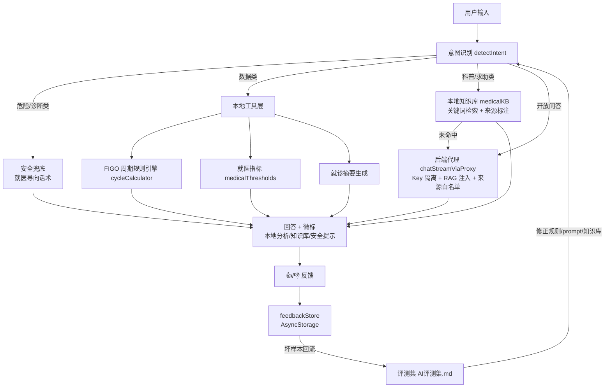

# Luna AI 助手产品设计文档

> 用途：作为 AI 产品经理面试 / 团队评审的核心材料，说明 AI 能力边界、策略与评测。
> 关联代码：`src/services/agentTools.js`、`src/services/medicalKB.js`（客户端 12 条）、`server/medicalKB.js`（服务端 21 条 RAG）、`server/index.js`（AI 代理 + 来源白名单）、`src/services/wearableStore.js`、`src/screens/AIScreen.js`
> 版本：v1.1（2026-08-31，对齐后端化：AI 代理 / 服务端 RAG / 多用户 / 穿戴接入）

---

## 一、产品定位与 AI 边界

**一句话定位**：Luna AI 是「**基于用户经期数据、可溯源、不越界**」的个人健康助手，不是医生，也不是诊断工具。

### AI 能力边界（明确写死）
| 能做 | 不能做 |
|---|---|
| 基于用户记录做 FIGO 周期分析 | 给出诊断结论 / 疾病判断 |
| 解读就医指标趋势（正常/关注/建议就医） | 替代医生面诊 / 开药建议 |
| 生成就诊摘要供医生参考 | 回答「是不是怀孕/癌症」等诊断类问题 |
| 知识库科普问答（带来源） | 对紧急症状轻描淡写 |

### 三条设计铁律
1. **确定性优先**：能用本地规则/数据回答的，绝不上 LLM（省成本、可控、可溯源）。
2. **安全兜底优先**：危险/诊断类问题 100% 走兜底话术，禁止 LLM 自由发挥。
3. **隐私优先**：核心逻辑本地运行，云端仅处理开放问答，反馈只存摘要。

---

## 二、用户任务与 AI 介入点

| 用户任务 | AI 介入方式 | 数据来源 | 成本 |
|---|---|---|---|
| 我的周期正常吗 | 工具 `analyzeCycles` | FIGO 规则引擎 + 用户记录 | 0（本地） |
| 什么时候排卵 / 现在什么阶段 | 工具 `getPhaseSummary` | 周期推算 | 0（本地） |
| 就医指标怎么看 | 工具 `getIndicatorTrends` | 6 项就医指标 | 0（本地） |
| 就诊前准备 | 工具 `generateVisitSummary` | 周期 + 指标汇总 | 0（本地） |
| 健康科普（什么是…/怎么办） | 本地知识库 `searchKB` → 未命中走**服务端 RAG** | 客户端 12 条 + 服务端 21 条权威条目 | 0（本地）/ 服务端检索 0 token |
| 开放咨询（知识库未覆盖） | **云端代理** `chatStreamViaProxy`（Key 只在服务端）+ RAG 注入 | LLM（DeepSeek） | 有成本 |

> 结论：**绝大多数高频问题本地即可解决**，云端只是兜底——这既是隐私卖点，也是成本优势（见《AI成本估算.md》）。

---

## 三、Prompt 策略

### 3.1 策略总原则：三级架构、逐级兜底
```
用户输入
  → ① 安全兜底（危险问题，规则）
  → ② 本地工具（数据类，规则引擎）
  → ③ 本地知识库（科普类，检索）
  → ④ 服务端 RAG（`augmentMessages` 注入权威条目 + 来源白名单）
  → ⑤ 云端 LLM（开放问答，DeepSeek 代理）
```

### 3.2 云端 system prompt（服务端实际生效，2026-08-31 已接入后端）
```
你是 Luna 的 AI 健康助手。你的用户是一位记录经期与症状的女性。

必须遵守：
1. 你不是医生，不能做诊断，不能开药。回答涉及健康判断时，必须以
   "以上为健康科普参考，不构成医疗诊断" 结尾。
2. 涉及剧烈腹痛、大量出血、疑似怀孕/宫外孕/流产等紧急或诊断性问题，
   必须引导立即就医，不得猜测性回答。
3. 引用医学信息时，尽量给出依据来源（如 FIGO 标准、公开指南）；无法
   确认来源的信息，明确说明这是通用建议。
4. 回答要简洁、可落地、有同理心；不要堆砌术语。
5. 可以使用用户提供的周期/症状数据，但只能做"描述与提醒"，
   不得下"你得病了"类结论。
```

> **服务端增强（2026-08-31 已实现）**：`server/index.js` 转发前用 `augmentMessages()` 做两件事：
> 1. **RAG 注入**：对最后一条用户消息 `searchKB` 检索 `server/medicalKB.js`（21 条带来源权威条目），命中则注入 system「权威条目」块 → LLM **基于条目回答**，不编造条目外内容。
> 2. **来源白名单**：`MEDICAL_SOURCES` + `SOURCE_RULE` 强制回答标注「（来源：XXX）」，来源仅限白名单（FIGO/WHO/中国共识/通用科普/Luna 内置），无法溯源标「（通用建议）」，**严禁编造来源**。

### 3.3 Prompt 版本管理与评测挂钩
- 每次修改 prompt → 全量跑 `AI评测集.md` → 记录版本号与指标变化。
- 用户 👎 反馈回流为坏样本 → 反哺 prompt 修正（数据飞轮）。

---

## 四、失败模式清单（AI 产品经理必答项）

| # | 失败模式 | 表现 | 处置策略 |
|---|---|---|---|
| F1 | 意图误判 | 数据类问题走错工具 / 求助类被工具拦截 | 扩展/调整 `detectIntent` 关键词；已加「定义/求助类优先知识库」规则 |
| F2 | 知识库未命中 | 科普问题转服务端 RAG，再未命中才走云端 | 已扩到服务端 21 条；保留云端兜底 |
| F3 | LLM 幻觉 / 编造文献 | 回答出现无依据内容 | system prompt 强制「给来源/明确无法确认」；评测集幻觉率指标把关 |
| F4 | 越界诊断 | LLM 输出诊断性结论 | 危险关键词前置兜底 + prompt 硬约束 + 评测回归 |
| F5 | 敏感/危险问题 | 用户问怀孕/癌症等 | `DANGEROUS_KEYWORDS` 100% 拦截走就医导向兜底 |
| F6 | 多轮串扰 | 上下文污染导致误答 | 云端只传当前对话历史；本地工具按单条输入判定（当前实现） |
| F7 | 网络失败/超时 / Android 明文 HTTP 拦截 | 云端不可用（真机 release 曾连不上） | 本地工具/知识库不受影响（核心可用）；后端代理失败降级本地直连（仅开发）；**release 已用 `networkSecurityConfig` 放行后端域明文** |

---

## 五、评测指标（与《AI评测集.md》对齐）

| 指标 | 目标 | 工具/来源 |
|---|---|---|
| 工具命中率 | ≥ 90% | `AI评测集.md` A 类 |
| 回答正确率 | ≥ 85% | 全量黄金问答对 |
| 幻觉率（反指标） | ≤ 5% | B/C 类 |
| 危险兜底触发率 | = 100% | B 类 |
| 免责覆盖率 | = 100% | 涉医回答 |
| 知识库命中率 | ≥ 90% | C 类 |
| 反馈回收率 | 追踪趋势 | `feedbackStore` |

---

## 六、Agent 架构图



---

## 七、隐私与数据流

- **本地优先**：工具与知识库在设备端运行，不经云端，天然保护健康数据。
- **云端最小化 + Key 隔离（2026-08-30 起）**：DeepSeek Key **只存服务端 `server/.env`**，App 永不接触；开放问答通过**后端代理**转发，客户端无 Key。
- **服务端 RAG 增强**：科普问答先命中服务端 21 条权威知识库（注入条目 + 强制来源），既降 token 成本又防编造来源。
- **云同步 + 多用户（2026-08-31）**：记录经后端写入 SQLite（`server/db.js`，sql.js WASM 零编译）；每设备 `getDeviceUserId()` 生成**匿名随机 userId**，数据按设备隔离，不采集身份。
- **穿戴数据可插拔**：`wearableStore` Provider 模式（模拟 ↔ Health Connect），健康数据上传走 `/api/health-data/sync` 入 SQLite。
- **明文 HTTP 仅按域放行**：Android `networkSecurityConfig` 默认禁明文，仅放行后端 IP + 本地调试地址（上架/生产换 HTTPS 后移除）。
- **反馈摘要化**：`feedbackStore` 只存 80 字摘要与来源，不存完整对话。
- **合规底线**：所有涉医回答带免责；紧急/危险问题强制就医导向。
