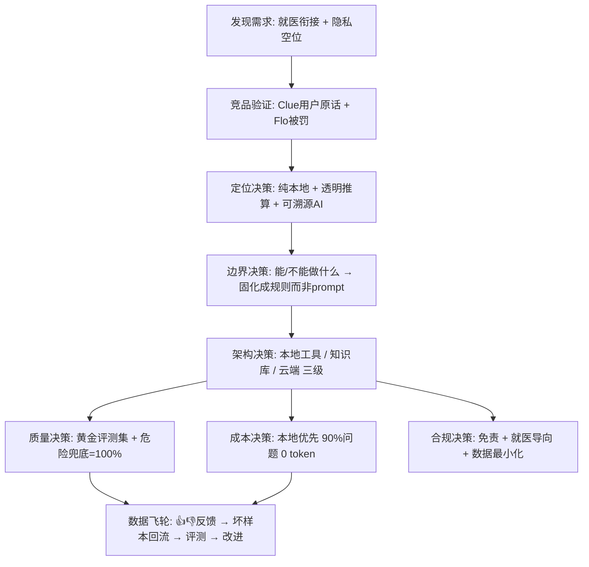

# Luna 项目讲述框架（AI 产品经理视角）

> 用途：面试/自我介绍前**先看这一份**。解决「项目很完整但摸不清怎么讲」——把 Luna 从「功能/模块地图」换成「决策地图」，让面试官从一开始就带着「这是一个产品负责人」的框架听你讲。
> 配合使用：具体 Demo 操作与讲稿看《面试演示脚本.md》；被追问细节时按文末索引回对应文档。

---

## 〇、你的角色定位句（开场 30 秒，先立框架）

> 「Luna 是我用 **AI 产品经理方法论**做的完整独立项目。它证明的不是『我会写 React Native』，而是：**我能把一个从 0 到 1 的 AI 产品，用可验证的证据链讲清楚——为什么做、边界在哪、质量怎么管、要烧多少钱、怎么合规迭代。** 这个项目里，我扮演的是产品负责人：负责定义问题、判断取舍、设计质量与成本机制，代码只是把决策落地的手段。」

> 讲完这 30 秒，面试官心里就会把你归到「产品负责人」而非「会写代码的爱好者」。

---

## 一、决策地图（把你的项目从模块变成决策链）

你之前看项目是**模块视角**（数据/设计/评测/成本/合规各一份），所以觉得是碎片。AI 产品经理要用**决策视角**讲故事——每个模块背后都是一次「我判断了什么」：

**判断标准**：每环你都能讲出「判断 + 依据 + 验证」，你就是 AI 产品经理；只讲「我实现了什么」，就退回成了程序员。

---

## 二、叙事主线（五段话 = 完整故事）

**主线**：一个真实用户需求 → 竞品验证 → 三个关键产品判断 → 用评测/成本/合规证明成立 → 沉淀方法论。

每个模块都用同一个公式讲，就不会乱：

> **我做了 X（决策/动作）→ 因为 Y（证据/逻辑）→ 结果是 Z（量化/验证）**

| 环节 | 你的 X（判断） | 你的 Y（证据） | 你的 Z（结果） |
|---|---|---|---|
| **需求** | 不做通用记录工具，占「就医衔接+隐私」空位 | Clue 用户原话「医生发现我 PCOS」「看医生非常有用」；Flo 因共享数据被 FTC 罚 | 北极星「周连续记录率」 |
| **边界** | AI 不诊断、不开药，**边界固化成规则** | 医疗 AI 的合规底线 | 危险问题 100% 兜底，规则保证非模型自觉 |
| **架构** | 三级架构，**能确定的不交给 AI** | 数据类用 FIGO 规则是确定性；LLM 反而会答错且贵 | 90% 高频问题本地 0 token，可溯源 |
| **质量** | 建立评测集管 AI，「不裸奔」 | 单靠 prompt 不可靠 | 20+ 黄金用例、工具命中 ≥90%、幻觉 ≤5% |
| **闭环** | 反馈回流成坏样本 | 质量问题要靠数据迭代 | 👍/👎 → 评测 → 改进的数据飞轮 |

---

## 三、突出「个人作用」的 3 个抓手（独立项目必考）

独立项目最大的坑：面试官问「**这不都是你一个人写的吗？产品经理体现在哪？**」用三招破解：

**抓手 1：把「做了什么」翻译成「我判断/取舍了什么」**
- ❌ 错：「我做了意图识别、4 个 Agent 工具、流式对话」
- ✅ 对：「我判断**数据类问题不该交给 LLM**——所以用 FIGO 规则引擎做工具层，LLM 只兜底开放问答。这个判断同时解决了准确、成本、隐私、可溯源四件事。」
- 主语永远是「我判断 / 我取舍 / 我权衡」，不是「我实现」。

**抓手 2：主动讲「我知道的边界」，反而证明你在当 PM**
要主动说，别等人问：
> 「我明确知道当前是 Demo 未闭环：数据是模拟的、RAG 是本地知识库不是文献检索。所以我的下一步优先级是：①真实用户访谈验证『就医衔接』假设 → ②接真实数据流 → ③医学文献 RAG + 引用合规。」
- 这暴露的不是弱点，是 **PM 的优先级排序和诚实**。

**抓手 3：讲「方法论沉淀」，把项目从「一件事」变成「一套做事框架」**
> 「我做的不只是一个 App，而是把『需求→竞品→设计→评测→成本→合规→数据飞轮』沉淀成了可复用的方法论，写成了 VS Code 可调用的 skill。以后任何 AI 产品我都可以按这套框架走。」
- 这句话把你和「会写代码的爱好者」彻底区分开。

---

## 四、与《面试演示脚本.md》的配合

| 场景 | 用哪份 |
|---|---|
| 开场定位 / 角色句 | 本文件「〇」+ 脚本「〇/二」 |
| 真机 Demo 逐步骤 | 《面试演示脚本.md》第三节 |
| 深挖 8 连问（安全/质量/成本/Agent） | 《面试演示脚本.md》第四节 |
| 现场画架构图 | 本文件「一」的决策图 + 脚本第五节白板项 |

---

## 五、被追问细节时，回哪份文档（索引）

| 面试官问 | 你回应的证据 | 对应文档 |
|---|---|---|
| 为什么做这个产品 / 差异化 | 竞品证据链：Clue 原话、Flo 被罚、机会点 P0/P1/P2 | `竞品分析.md` / `需求分析.md` |
| 北极星指标 / 怎么验证假设 | 周连续记录率 + 辅助/反指标 + 排查路径 | `需求分析.md` 第五节 |
| AI 边界 / 三级架构 / Prompt / 失败模式 | 能做不能做表 + 四条铁律 + F1~F7 | `AI产品设计.md` |
| 质量怎么管 / 评测集 | 20+ 黄金用例、A/B/C/D 类、4 项指标、闭环 | `AI评测集.md` |
| 会不会烧钱 / 延迟 | 三级架构 0 token、月成本约 $20、降级策略 | `AI成本估算.md` |
| 你一个人怎么做 PM | 本文件「三」三个抓手 + 方法论沉淀（skill） | 本文件 / `skill.md` |

---

## 六、面试一页速记（临场前扫一眼）

1. 定位：**纯本地隐私 + 透明推算 + 可溯源 AI**，占「就医衔接 + 隐私」空位
2. 北极星：**周连续记录率**
3. 三判断：**边界固化成规则** / **能确定的不交给 AI** / **AI 不裸奔（评测集兜底）**
4. 三个数字：**危险兜底 =100%** / **幻觉率 ≤5%** / **月成本 ≈ $20**
5. 一条主线：**需求 → 竞品 → 设计 → 评测 → 成本 → 合规 → 数据飞轮**
6. 主动讲边界：模拟数据、RAG 未做、BASE_URL 占位——但下一步优先级清晰
