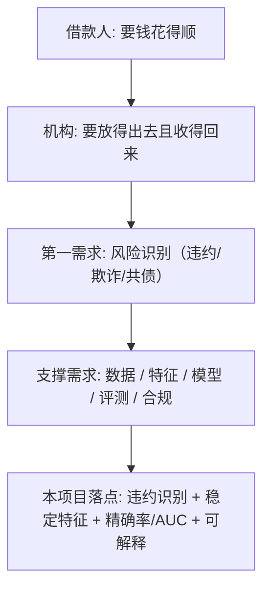

# 个人消费信贷需求分析（行业级 / 服务毕业设计 PM 视角）

> 用途：为「个人消费信贷风险识别项目」（毕业设计）提供**行业级需求分析**，回答「个人消费信贷这门生意为什么存在、用户的真实需求是什么、为什么『风险识别』是它的第一需求」。用于：① 面试时展示对消费信贷领域的业务理解；② 为 `个人消费信贷风险项目-产品视角.md` 的业务判断提供证据支撑。
> 方法：参考 Luna `需求分析.md` 的框架（事实基线 → 需求澄清 → 证据整理 → 待验证假设 → 验证方式），严格区分「公开可核验事实」「典型反馈类型」「【推断】」「证据缺口」。
> ⚠️ 本报告为**事实梳理 + 需求分析**，最终业务判断由产品经理完成；所有行业数据为公开常识口径，精确数字请以监管/公司年报核验。

---

## 〇、为什么做这份需求分析（定位）

个人消费信贷不是一个"功能"，是一门**以风险定价为核心的金融生意**。AI 产品经理讲信贷项目时，如果不先讲清「这门生意的需求结构」，就讲不清「为什么违约识别值得做」。这份需求分析回答三层：

1. **这门生意为什么存在**（市场与需求本质）
2. **谁是用户、用户要什么**（借款人 / 资金方 / 平台 三方需求）
3. **为什么「风险识别」是第一需求**（本项目的业务落点）

---

## 一、市场结构（行业事实基线，公开可核验）

### 1.1 这门生意为什么存在：需求本质是「跨期消费平滑」
个人消费信贷的本质，是让**没有当期现金但有未来收入**的人，用「未来的钱」提前满足**当期消费**（装修、教育、医疗、3C、婚庆、应急周转）。它解决的不是「要不要消费」，而是「**想花但暂时没钱 → 分期/先借后还 → 平滑当期支出**」。
- 对个人：把大额支出拆成可承受的月供，缓解现金流压力
- 对经济：消费是内需核心，信贷是提前释放消费力的工具【公开常识】

### 1.2 参与主体与竞争格局
| 主体 | 代表 | 资金/风控特点 |
|---|---|---|
| 银行（线上消费贷） | 建行快贷、招行闪电贷 | 低利率、额度大、客群优质；征信强约束 |
| 信用卡分期 | 各家银行 | 场景消费 + 免息期；依赖央行征信 + 行为数据 |
| 消费金融公司 | 招联金融、马上消金、中银消金、捷信 | 客群比银行下沉，填补「银行够不着、黑市不敢碰」的中间层 |
| 互联网平台信贷 | 花呗/借呗（蚂蚁消金）、微粒贷（微众银行）、京东白条/金条、美团借钱 | 场景入口 + 大数据风控 + 极致体验 |
| 助贷/联合贷 | 平台 + 银行合作 | 流量与风控能力方 + 资金方分工 |

> **PM 视角**：这几类主体的本质差异不在"额度/利率"，而在**客群风险结构与数据能力**——银行靠征信强约束，互联网平台靠行为/场景数据，消金公司靠更下沉客群的精细化风控。**这就是"风险识别"在每家机构的权重不同、但都不可或缺的原因。**

### 1.3 监管框架（金融 AI 的红线来源）
- **利率上限**：民间借贷利率司法保护上限 = LPR 4 倍（2020 年新规，约为 15.4% 上下浮动）；金融机构贷款综合息费普遍要求控制在 24% 以内（"两线三区"口径）
- **准入与助贷**：消费金融公司需持牌（2024 年修订《消费金融公司管理办法》）；互联网助贷业务 2024 年出台专门监管通知，要求平台与银行权责清晰、风险隔离
- **征信**：花呗、借呗等已接入央行征信；二代征信信息更全面（含共同借款、大额分期）
- **数据合规**：《个人信息保护法》（2021）约束信贷场景的敏感信息处理；《征信业管理条例》约束征信数据使用
- **消费贷款用途**：2024 年修订《个人消费贷款管理办法》，明确**禁止资金流入房市/股市**，强化用途真实性审查

> **连接毕业设计**：监管要求「用途真实、风险可控、可解释」——这正是项目里「稳定特征 + 可解释模型（Logit）」的合规出发点（呼应 `个人消费信贷风险项目-产品视角.md` 第六节）。

---

## 二、需求分层：谁是用户、用户要什么

> 信贷是**双边市场**：借款人是"需求方"，但**机构才是产品的"买单方"**。AI PM 必须同时看清两边，否则会把"借款人想要更便宜"当成唯一需求。

### 2.1 借款人需求（C 端）
| 需求 | 场景 | 本质 |
|---|---|---|
| 大额消费平滑 | 装修、教育、医疗、婚庆、3C | 当期现金不足，用未来收入平滑支出 |
| 应急周转 | 突发医疗、临时资金缺口 | 对"快"和"可得性"最敏感 |
| 额度/期限灵活 | 想借就借、想还就还、按日计息 | 对"使用弹性"的诉求 |
| 隐私与面子 | 不希望被催收打扰、不希望过度打扰通讯录 | 对"体面"的诉求（常见于正规产品 vs 违规现金贷的差异点） |

> 关键区分：**正常借贷需求 vs 过度/被动借贷**。监管与公众讨论中反复出现的「以贷养贷」「年轻人过度消费」指向的是后者——这恰恰是**风险识别（而非放量）**成为行业需求的原因【公开讨论，见证据缺口】。

### 2.2 资金方 / 平台需求（B 端，本项目的真正"用户"）
| 需求 | 业务含义 | 对应项目动作 |
|---|---|---|
| **识别违约风险（本项目）** | 放款前判断「谁更可能不还」 | 违约二分类模型 |
| 防欺诈 | 识别骗贷、冒用、团伙 | 反欺诈（独立于信用评分） |
| 控共债/多头 | 识别以贷养贷 | 多头借贷特征 |
| 定价与额度 | 风险越高 → 利率越高/额度越低 | 评分 → 定价联动 |
| 合规 | 可解释、公平、用途真实 | 可解释模型 + 特征合规 |

### 2.3 需求金字塔（PM 视角画图）

> **结论**：借款人的需求是"入口"，**机构的「风险识别」才是这门生意的"心脏"**。这就是为什么一个毕业设计选"违约识别"课题，本质是在做**信贷生意最核心的需求**——这个认知是面试时把算法项目讲成产品项目的关键。

---

## 三、为什么「风险识别」是消费信贷的第一需求（业务算账）

### 3.1 信贷的成本结构：坏账是最大的成本
信贷业务的收入 = 利息/手续费；成本 = 资金成本 + 运营成本 + **坏账损失 + 获客成本**。对信贷机构，**坏账率每上升 1 个点，可能吃掉大量利润**——所以"少放错款"的优先级常常高于"多放款"。

### 3.2 违约识别 = 在「多赚」与「少亏」之间找最优切点
- 模型过松（切点低）：放款多、收入多，但坏账上升
- 模型过严（切点高）：坏账低，但误伤好客户、放量不足
- **最优切点在"边际坏账成本 = 边际利息收入"处**——这不是模型参数，是**商业决策**（呼应 `个人消费信贷风险项目-产品视角.md` 2.4）

### 3.3 不同机构对风险识别的需求差异
| 机构 | 对风险识别的需求 | 侧重指标 |
|---|---|---|
| 银行 | 强征信约束、低不良容忍 | 区分度（AUC/KS）、可解释 |
| 互联网平台 | 大数据风控、秒级决策 | 精确率（少放错款）、响应速度 |
| 消金公司 | 下沉客群精细化风控 | 稳定特征（抗客群漂移） |

> **连接毕业设计**：项目强调「**稳定特征**」而非单纯追求 AUC 最高，正对应真实业务里"**客群会漂移、模型不能过期**"的需求——这是把"指标最好"翻译成"业务最耐用"的关键差异。

---

## 四、针对「违约识别」的需求澄清（本项目视角的假设）

> 参考 Luna 需求分析的做法：列出需求假设 + 证据状态，明确哪些已验证、哪些是待验证。

| # | 需求假设 | 证据状态 |
|---|---|---|
| H1 | 机构需要"违约/非违约"的**二分类判定**作为准入依据 | 成立（信贷风控的通用做法，公开常识） |
| H2 | **稳定特征**比单点高区分特征更重要（抗客群漂移） | 待验证：项目内做了统计口径稳定性，未做真实时间序列漂移验证【诚实边界】 |
| H3 | **精确率 + AUC** 是衡量"放错款成本 + 排序区分度"的核心指标 | 成立（风控行业通用口径，公开常识） |
| H4 | **可解释模型**（Logit）是合规底线（监管可审计） | 成立（监管公开要求模型可解释/可审计） |
| H5 | 公开数据集（Kaggle）能近似真实授信业务 | **高风险假设**：样本无真实客群/逾期口径，结论不可直接外推 |

### 高优先级待验证假设（按风险排序）
1. **H5（公开数据近似真实业务）**——最高风险。离线回测的"稳定"与"精确率"在真实客群上可能不成立，面试必须诚实说明。
2. **H2（稳定特征价值）**——需要真实时间序列数据验证 PSI 才坐实。
3. **H4（可解释=合规）**——方向正确，但"如何量化可解释性"（如 SHAP/特征贡献）未做【推断：可用可解释工具补强】。

---

## 五、证据整理（严格区分「明确说的」与「推断的」）

### 5.1 公开可核验的事实（可直接引用）
- 利率监管：民间借贷司法保护上限 = LPR 4 倍；金融机构综合息费普遍 ≤24%【公开法规，需按当期 LPR 核验精确值】
- 持牌准入：消费金融公司需持牌经营（《消费金融公司管理办法》2024 修订）【公开法规】
- 资金用途：消费贷资金不得流入房市/股市（《个人消费贷款管理办法》2024 修订）【公开法规】
- 征信接入：花呗、借呗等互联网信贷已接入央行征信【公开报道，需按当期新闻核验】
- 数据合规：信贷场景个人信息处理受《个人信息保护法》约束【公开法规】

### 5.2 项目「明确做的」（来自 `个人消费信贷风险项目-产品视角.md`，可追溯）
- Kaggle 数据集：30 万行 × 122 特征（违约二分类）
- 方法：特征工程与筛选（IV + 稳定性 + 相关性）→ 稳定特征集 → Logit/SVM/RF 融合
- 目标：提升精确率（Precision）与 AUC

### 5.3 【推断】的内容（无直接证据，仅合理推测）
- 「借款人更看重"快"而非"低利率"」——推断自公开讨论，**无一手用户数据**
- 「消金公司比银行更需要抗漂移的稳定特征」——推断自客群结构差异，**无一手数据**

### 5.4 ⚠️ 证据缺口（必须上报，禁止脑补）
1. **零一手用户原声**：无真实借款人访谈/投诉原文引用——需求洞察均基于公开常识与推断，需访谈或采证后回填。
2. **零真实业务数据**：Kaggle 非真实授信样本，"稳定特征/精确率"结论未在真实客群验证。
3. **行业数据精确值待核验**：利率上限、投诉量级、市场规模等精确数字需以当期监管文件/公司年报为准。

---

## 六、低成本验证方式（供 PM 决策，非方案）

| 假设 | 验证方式 | 成本 |
|---|---|---|
| H2（稳定特征价值） | 把公开集按时间切分做**时序回测**，对比训练段/测试段特征分布（PSI） | 低（Python 可做） |
| H3（指标口径） | 画**通过率-坏账率/PR 曲线**，演示切点对业务利润的影响 | 低 |
| H5（数据外推风险） | 明确标注**离线 vs 在线口径差异**，避免面试夸大 | 低（诚实口径） |
| H1/H4（需求真实性） | 访谈 1~2 位信贷/风控从业者，确认"二分类准入 + 可解释"是否真实业务主流 | 中 |

---

## 七、对面试的连接（这份需求分析怎么用）

| 面试场景 | 怎么用 |
|---|---|
| 被问「你懂消费信贷吗」 | 讲「一、市场结构 + 二、需求分层」：这门生意是双边市场，风险识别是心脏 |
| 被问「为什么做违约识别课题」 | 讲「三、第一需求」：坏账是最大成本，识别违约 = 在多赚与少亏间找切点 |
| 被问「模型指标什么意思」 | 讲「三 + 需求金字塔」：精确率=放错款成本、AUC=排序区分度、稳定特征=抗漂移 |
| 被问「项目有什么局限」 | 讲「五.4 证据缺口 + 六 验证方式」：公开数据、离线回测、需真实数据验证 |

> **一句话收束**：个人消费信贷的需求本质是「用未来收入平滑当期消费」，而支撑这门生意的**第一需求是风险识别**——我的毕业设计做的正是这件事的核心一环：**用稳定特征 + 可解释模型，把"谁更可能违约"判断得更准、更稳、更可审计。**
