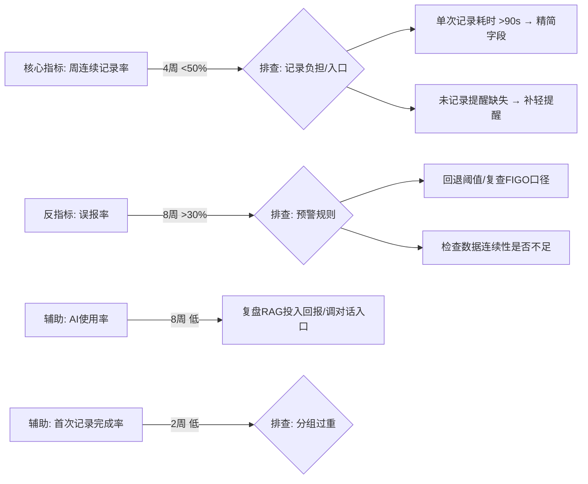

# Luna 经期健康管理 App — 需求分析报告

> 分析基准：`d:\Luna` 代码库（React Native 0.86 / 五个 Tab 页面 / 记录弹窗 / FIGO 规则引擎已落地）
> 版本：v1.0.0（Demo 阶段，大量数据为模拟值）
> 日期：2026-08-24
> ⚠️ 本报告仅做事实梳理与风险提示，**最终业务判断由产品经理完成**

---

## 〇、项目事实基线（代码可验证，非推断）

| 维度 | 已实现（代码验证，2026-08-31） | 占位 / 未实现 |
|---|---|---|
| 记录能力 | `RecordBottomSheet` 问诊式分组 + `periodStore` 持久化 + **服务端云同步（SQLite）** | — |
| 周期推算 | `cycleCalculator` + 首页/观察页全部读真实记录派生（已去硬编码） | — |
| 医学规则 | `medicalThresholds` FIGO + 6 项就医指标 + 来源标注 | 未经真实人群/医生正式校验 |
| 观察页 | 折线/柱状图 + 指标徽章 + **PDF 复诊报告导出**（后端 pdfkit） | — |
| AI 助手 | 流式对话 + **后端代理**（Key 隔离）+ **服务端 RAG 21 条 + 来源白名单** + 客户端知识库 12 条 | AI 仍为科普级，非医学诊断 |
| 穿戴数据 | `wearableStore` **Provider 模式**（模拟双相 ↔ Health Connect 框架） | 真实设备未接入；当前为模拟数据 |
| 隐私 | AsyncStorage + 云端 Key 隔离 + **匿名 userId 多用户隔离** | 无账号体系、无删除/导出自己数据入口、无独立隐私政策页、未上 HTTPS |
| 导出 | ✅ **PDF 复诊报告已实现**（`POST /api/report` + 客户端导出） | 仅客户端触发 |
| 部署 | ✅ **公网上线**（腾讯云 Windows Server，计划任务常驻，/health+records+AI 全 200） | 后端为 HTTP 明文，未上 HTTPS/域名 |

---

## 一、需求澄清（不写方案）

### 1.1 用户问题（现状痛点假设）
- 经期类产品普遍存在「记录负担重 → 坚持不下来」的流失问题，而**异常预警必须依赖连续记录**才有效，两者存在根本矛盾。
- 通用经期 App 的「黑箱预测」缺乏可解释性，用户不知道预测依据，难以信任。
- 需要判断何时就医时，用户缺乏结构化记录（医生问诊常问：出血量、血块、疼痛、用药、周期规律性），导致就诊效率低。

### 1.2 团队假设（已从代码/README 读出）
| 编号 | 假设 | 来源 |
|---|---|---|
| A1 | 用户愿意为「科学/循证」买单：FIGO 规则、医学指标追踪能成为差异化 | README 核心原则、medicalThresholds |
| A2 | 预警类文案「建议就医/建议关注」比诊断式表达更能降低焦虑、提高留存 | README 原则 2、ALERT_STYLES 文案 |
| A3 | 日历不评判、只展示客观数字能避免制造焦虑 | README 原则 3 |
| A4 | 记录分组按「医生问诊优先级」能提升记录质量（对齐问诊逻辑） | RecordBottomSheet 注释 |
| A5 | 个人隐私（本地存储、无账号）是核心卖点 | README「简洁、科学、隐私」 |

### 1.3 高优先级待验证假设（按风险排序）
1. **A1（循证=价值）**：最高风险。若无真实用户验证，医学功能可能只是「工程师自嗨」，用户并不需要 FIGO 级别的严谨度。
2. **A2（不诊断=降低焦虑）**：待验证「温和文案」是否反而让部分用户觉得「没结论、没用」。
3. **A5（隐私=卖点）**：在 Android 上纯本地+无云同步，与「多设备、防丢失」需求可能冲突。
4. **A4（问诊优先级分组）**：用户是否理解 6 大分组？记录完成率是否因此受影响？

### 1.4 低成本验证方式（供 PM 决策，非方案）
- **访谈 5~8 名真实经期用户**：验证 A1/A2/A5，重点问「上一次看医生前最想记下什么」。
- **原型可用性测试**：给 3~5 人装 Demo，观察首次记录耗时与放弃点，验证 A4。
- **竞品对照**：对比 Flo/Clue/美柚 的「预测+预警」口径，验证 A2 差异是否成立。
- **A/B 文案测试**：同一预警，一组「建议就医」、一组「建议关注」之外的第三组「中性描述」，测焦虑与信任。

---

## 二、证据整理（严格区分「明确说的」与「推断的」）

### 2.1 用户/项目「明确说的」（可引用、可追溯）
> 以下均来自项目内可验证文本，非访谈记录：

- README：「一款适用于个人的经期管理 app，兼具**简洁、科学、隐私**」「聚焦**周期异常预警与就医衔接**」。
- README 原则 1：「所有阶段均基于用户**手动记录的经期日期 + 历史平均周期**计算得出，非黑箱判断」。
- README 原则 2：「异常判断仅供参考，不做诊断」「UI 文案统一使用'建议就医/建议关注'**而非确定性诊断用语**」。
- README 原则 3：「日历模块**不做主观评判**……不给出'正常/异常'结论，避免引发用户焦虑」。
- README 原则 4：「记录分组遵循临床问诊优先级：出血情况 > 疼痛 > 内分泌 > 凝血 > 用药 > 主观感受」。
- 代码（medicalThresholds）：阈值参考「FIGO AUB 分类系统（2011 年更新）」；「经间期出血 1 次即为就医指征（FIGO AUB-E）」；「泌乳是高泌乳素血症常见筛查指标」。
- 代码（AIScreen 初始语）：「我基于妇产科循证医学文献回答问题，**但不替代医生诊断**」。

### 2.2 团队「推断的」（无直接文本证据，仅合理推测）
- 推断目标用户画像为「关注科学记录、可能就医的育龄女性」——**代码未出现任何用户画像数据**。
- 推断「就医衔接」是核心价值——README 有此定位，但**无用户需求证据支撑该定位正确**。
- 推断「记录负担」是主要流失点——竞品常识，**本项目内无数据**。

### 2.3 ⚠️ 证据缺口（2026-08-31 更新：部分已补）
1. **零用户原声（仍缺）**：全项目无任何真实用户访谈/评论/问卷引用——需 PM 采集后回填。
2. **真实数据流（已补基础）**：记录已走真实链路（`periodStore` → SQLite 云同步），预警用真实派生数据跑通；但**仍是开发者自录数据、非真实人群**，误报率/漏报率仍待真实用户验证。
3. **AI 医学保障（已补基础）**：服务端 RAG 21 条 + 来源白名单 + 幻觉评测已实现；但**仍是科普级知识库、非医学文献级**，不可对外承诺医学准确度。
4. **医疗合规（部分补）**：PDF 报告含免责声明、AI 回答强制来源标注；但**仍无隐私政策页、无数据删除/导出自己数据入口、无人工复核**，健康类上架合规风险仍在。

---

## 三、MVP 拆解（明确标注边界）

### 3.1 本期必须做（打通「记录 → 预警」最小闭环）
- [x] **本地记录**（出血/疼痛/经血量/血块/用药等核心字段）落 AsyncStorage，从 `console.log` 改为真实存储。
- [x] **周期推算与预警**：基于真实历史数据跑通 `calcAverageCycle` + `checkAlerts`（当前是硬编码 `18/29`，必须接真实数据）。
- [x] **日历客观统计**：经期天数/已记录天数切换为真实数据源。
- [x] **记录连续性提示**（最小版）：超过 N 天未记录时轻提醒，支撑预警有效性——这是上面「记录-预警」闭环的前提。
- [x] **隐私基础**：本地存储 + 明确「数据不上传」的文案（对齐「隐私」定位，且是合规底线）。

### 3.2 本期不做（明确排除，禁止扩展）
- ❌ **AI 助手全功能**：RAG、医学知识库、流式回答——后端与医学内容均未就绪，**本期最多保留对话 UI 壳，不可承诺医学能力**。
- ❌ **穿戴设备接入**（HealthKit / HUAWEI Health Kit）：依赖平台授权与后端同步，且「今日提示」中「体温下降 0.2°C」这类结论性文案在无真实数据时是误导。
- ❌ **账号体系 / 云同步 / 多设备**：与「纯隐私本地」定位冲突，属后续大决策。
- ❌ **PDF 复诊报告导出**。
- ❌ **6 项就医指标全部上线**：如「体温双相」需要连续体温数据，本期无法采集，**该指标本期应降级或隐藏**。

### 3.3 后续再看（记录在案，本期不承诺）
- AI RAG 医疗问答（需医学团队/文献授权）
- 医生端 / 就诊报告共享
- 备孕/避孕辅助（README 未提及，**不主动扩展**）
- 社交/社区（明显偏离「隐私、个人」定位，**强烈建议不碰**）

---

## 四、红队评审（只找问题，不润色）

### 4.1 高风险假设（按危害排序）
| # | 高风险点 | 风险说明 |
|---|---|---|
| R1 | **预警规则未用真实人群验证（⚠️ 部分缓解 2026-08-31）** | 数据已改真实链路（periodStore → SQLite）跑通；但仍是开发者自录数据。真实人群周期波动大，**误报率仍未知**，误报「建议就医」会击穿信任与安全底线。 |
| R2 | **医学内容合规风险** | 已有来源白名单 + 回答强制来源标注；但仍无独立隐私政策页、无人工复核、未上 HTTPS。上架/投诉时健康类声明仍是审查重点。 |
| R3 | **AI 承诺过度（✅ 已缓解 2026-08-31）** | 服务端 RAG 21 条 + 来源白名单 + 幻觉评测已实现，回答强制带「（来源：XXX）」；但仍为科普级，不可承诺诊断/医学准确度。 |
| R4 | **无账号+纯本地 vs 数据丢失** | 手机更换/卸载即丢全部记录，而预警恰恰需要长期历史。这个矛盾没被任何假设覆盖。 |
| R5 | **穿戴数据假展示（✅ 已缓解 2026-08-31）** | 已删除硬编码「体温下降 0.2°C」假提示；`temp_biphasic` 改由模拟双相体温真实派生；Provider 模式留真实设备接入路径。 |

### 4.2 缺失证据（红队质问项）
- 没有任何数据证明「连续记录」能形成（无留存/记录率数据）。
- 没有任何证据证明「FIGO 严谨度」是用户付费/选择理由（可能是过度工程）。
- 没有任何证据证明目标人群确实会为「就医衔接」下载 App（多数经期用户并无就医需求）。
- 6 项就医指标中 `temp_biphasic` 需要连续基础体温，**采集路径本身缺失**，指标设计有自相矛盾。

### 4.3 评审挑战点（供 PM 拍板）
1. **「建议就医」文案 vs 免责**：当前 `danger` 文案直接说「建议就医」。在无医疗免责、无人工复核时，是否接受这一法律/伦理敞口？是否需加「仅供参考」兜底与来源链接？
2. **周期标准差阈值 9 天是否被验证**？FIGO 引用的是「变化>8~9天提示不规则」，但本项目是否真的照此执行需要核对原文。
3. **「经间期出血1次即 danger」**：FIGO AUB-E 确是 1 次即为异常，但用户可能记录的是「偶发点滴」，直接给 `danger` 是否过重、是否放大焦虑？与 A2 假设自洽吗？
4. **记录字段是否过度**：6 分组、近 20 个字段对「简洁」定位是矛盾的——「简洁」与「问诊级详细」的取舍必须 PM 明确，**当前二者在打架**。

---

## 五、指标设计

### 5.1 核心指标（北极星）
> **周连续记录率** = 过去 7 天记录≥3 天的活跃用户 / 7 天活跃用户

- 理由：所有预警/推算/趋势都依赖数据连续性，它是产品价值成立的唯一前提。连续记录率高 → 闭环有效 → 其它指标才有意义。
- 观察周期：**4 周**（覆盖至少 1 个完整周期，验证「跨经期不断记」）。
- 排查路径：连续记录率 <50% → 查「记录入口可见性（今日页按钮位置/日历点选）」「单次记录耗时（若>90s 即负担过重）」→ 对应排查 R-负担问题。

### 5.2 辅助指标（3 个）
1. **预警触发率与点击后行为**：触发「建议就医/关注」的用户中，查看详情/分享/导出报告的比例（验证「就医衔接」价值）。周期：8 周。
2. **AI 助手使用率**：7 天内发起 ≥1 次对话的用户占比，及对话后满意度（内置评价）。周期：8 周；**用于验证 RAG 投入是否带来留存**（RAG 已实现，此指标转为衡量投入回报）。
3. **新用户首次记录完成率**：注册后 24h 内完成首次记录的比例（验证 A4 分组设计是否让记录门槛过高）。周期：2 周。

### 5.3 反指标（2 个）
1. **误报率** = 触发 `danger` 但用户标记「不需要」/后续无就医的会话比例。
   - 观察周期：8 周。若 >30%，立即回退预警阈值并**排查 R1**（阈值合理性 + 数据质量）。
2. **30 天卸载/弃用率**（D30 留存反向）。
   - 观察周期：30 天滚动。结合卸载原因调研，验证「隐私本地」是否因「怕丢数据」而反噬（对应 R4）。

### 5.4 观察周期与排查路径总览

---

## 六、给 PM 的最终决策清单（非方案，仅留白待填）

| 决策项 | 现状 | 需 PM 拍板 |
|---|---|---|
| 目标用户与画像 | 无数据 | 谁先用？是否包含备孕/就医人群 |
| 「简洁」vs「问诊级详细」 | 记录字段 20+，二者矛盾 | 砍到多少字段？哪些默认收起 |
| 预警是否上线 | 无真实数据验证 | 先灰度还是先关掉 |
| AI 是否保留 | 无后端/无 RAG | 本期砍掉还是做壳 |
| 数据模式 | 纯本地 | 是否接受无云同步的数据丢失风险 |
| 合规底线 | 无免责/无来源/无删除 | 上架前必须补齐的最小项 |

---

**总结**：Luna 的工程骨架与医学规则设计是扎实的（FIGO 阈值、问诊分组、透明推算均为加分项），但当前处于「**Demo 未闭环**」状态——**真实数据流、真实用户反馈、医学合规三大支柱全部缺失**。最危险的三个点按优先级是：① 预警规则未用真实数据验证（误报伤信任）；② 首页穿戴/提示是模拟数据却以真实口吻展示（直接误导）；③ AI 声称循证但 RAG 未实现。MVP 应当收窄到「**本地记录 + 真实数据驱动的周期推算与预警 + 隐私承诺**」这一最小闭环，其余（AI、穿戴、导出、云同步）全部推迟。
